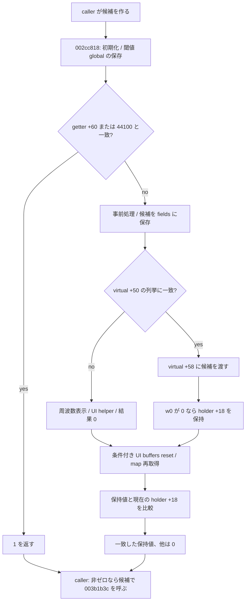

# SA-AE-TIME-003: 位置変換 rate の採用境界

[日本語](SA-AE-TIME-003-rate-adoption.md) · [English](SA-AE-TIME-003-rate-adoption.en.md) · [算術](SA-AE-TIME-001-position-conversion.md) · [context の更新](SA-AE-TIME-002-context-lifecycle.md)

**`FUN_002cc818` は副作用を持つ採用処理です。候補が一致する場合も、先行処理で global を更新し得ます。** 値が変わる経路は、候補の適合確認より前に object fields を書き、拒否時には周波数表示を作って UI helper を呼びます。非ゼロの返値を、rate 自体や一般的な読み取り成功と解釈しません。

| 項目 | 内容 |
|---|---|
| 日付・基準 | 2026-10-02、Logic Pro Creator Studio 12.3.1 / build 6682、`Logic.arm64` |
| import SHA-256 | `2f141e1a1f7b90a4fb0205ffec3dbe187baf601d20e9acb398acfadcdf050998` |
| 実行 | 保存済み `-noanalysis -readOnly` 出力の静的監査のみ。Logic へのイベント・接続・実機操作なし |
| 証拠 | [native boundaries manifest](appleevent-native-boundaries-manifest.json)。アドレスは slide 前のイメージアドレス |
| 範囲 | `0x002cc818`、直接 callee `0x002c8a10` / `0x002cbccc` / `0x002ccd44`、先行 caller の再照合 |

## 1. 証拠と ABI

| `Research/raw/ghidra/` のローカル出力 | 対象 |
|---|---|
| `q-appleevent-native-next-003.c` / `q-appleevent-native-next-003-machinecode.txt` | `FUN_002cc818`、1240 bytes |
| `q-appleevent-native-targets-003.c` / `q-appleevent-native-targets-003-machinecode.txt` | `FUN_002c8a10`、372 bytes |
| `q-appleevent-time-adoption-callees-003.c` / `q-appleevent-time-adoption-callees-003-machinecode.txt` | `FUN_002cbccc`、1040 bytes / `FUN_002ccd44`、780 bytes |
| `q-appleevent-time-rate-callers-002.c` / `q-appleevent-time-rate-callers-002-machinecode.txt` | `FUN_00417ad8` / `FUN_00417bfc` |

fresh export の identity は program 名と import SHA の一致を確認しています。全 decompile・大量の機械語は Git へ追加しません。C の `code *`、呼出し後の parameter alias、`FUN_0000ac44` 注釈は型や関数 pointer の証拠にしません。

`FUN_002cc818` の入力は `x0` の 64-bit 候補で、`0x002cc838` で `x19` に保持します。virtual call の receiver は **`H = *global(0x0275ff60)` の先頭 pointer `[H]`**、その vtable は `[[H]]` です。`H` 自体の fields と receiver の fields を混同しません。以下の `+0x40` 等は、この vtable 上の byte offset です。具体的な class、project/hardware の owner は未確定です。

## 2. 一致時にも先行する処理

`FUN_002c8a10(1)` は array entry `0x0261c788` を返します。一般には unsigned `w0 < 13` のとき `0x0261c5e8 + sign_extend(w0) * 0x1a0`、それ以外は null です（`0x002c8a28..0x002c8a38`）。初回は 13 entries を `FUN_002c8b84` で初期化し、atexit を登録します（`0x002c8a70..0x002c8b68`）。entry の先頭 pointer が `H` の receiver と同じという証拠はありません。

entry とその先頭 pointer が非 null なら、virtual `+0x40` に selector `0x12` を渡します（`0x002cc83c..0x002cc85c`）。返値を `A`、候補を `R` とすると、64-bit register 上で `A * 1000000` を計算し、signed `SDIV` で `R` による商を求めます。商が signed 比較で `3500` 未満なら `-6000` / `-7000`、それ以外なら両方 `-3500` を、global `0x025d0a88` / `0x025d0a8c` に `STLR` で保存します（`0x002cc860..0x002cc89c`）。この範囲に候補 0 を拒否する分岐はありません。任意入力の妥当性や商の意味・単位は確定しません。

その後、`H` が存在すれば virtual `+0x60` を呼び、0/不在なら即値 `44100` を使います。候補と一致すれば **`1`** を返し、列挙や virtual `+0x58` を行いません（`0x002cc8a0..0x002cc8d8`）。したがって「列挙内にあること」は、全非ゼロ返値の共通条件ではありません。

## 3. 変更経路の適合確認と返値

| 命令範囲 | 確定した処理 |
|---|---|
| `0x002cc8dc..0x002cc99c` | byte counters `0x025ce578` / `0x025cdbf0` を更新。後者の加算結果 bit8 が立つ場合、sentinel と state を使う別処理へ進む |
| `0x002cc9a0..0x002cc9c4` | `FUN_002cbccc` の返値を保持。`H` 不在なら後の結果は 0。存在すれば virtual `+0x118(receiver,0,0)` |
| `0x002cc9c8..0x002cc9d4` | **列挙前に**候補を `[H+0x70]` が指す領域の `+0` / `+0x10` と、`H+0x80` に保存 |
| `0x002cc9d8..0x002cca34` | virtual `+0x40(selector=10)` の signed count を使い、virtual `+0x50(index,0)` の返値と候補を比較。count は loop 内で再取得 |
| `0x002ccb04..0x002ccb24` | 一致した場合だけ virtual `+0x58(receiver,candidate)`。`w0 != 0` は結果 0、`w0 == 0` なら `H+0x18` の 64-bit 値を保持 |
| `0x002ccb28..0x002ccb3c` | virtual `+0x118` を `H+0x122` の byte と 0 で再度呼ぶ |
| `0x002ccc18..0x002ccc34` | 保持値が非ゼロなら `FUN_019c3fa4(0xd4)`。その後 global を読み直し、現在の `H+0x18` と一致するときだけ保持値を `x0` に返す。他は 0 |

列挙に一致しない場合、候補を double 化し `NSUnitFrequency::hertz` の `NSMeasurement` を formatter に渡します。formatted string と CFString record `0x02340bc8`（C の名称 `cf_SampleRate__notallowed_`）を `FUN_005881b8` に渡し、結果を 0 にします（`0x002cca38..0x002ccaf4`）。UI helper の呼出しは確定しましたが、実際の表示文言・modal 挙動は確認していません。

変更経路の非ゼロ返値は、virtual `+0x58` の 0 status と、保持した非ゼロ値が最後の照合時に現在の `H+0x18` と一致することを必要とします。返す値は候補 rate ではありません。**Hypothesis、確信度: 中:** `H+0x18` は状態または稼働対象の mask/token として使われます。bit test や同一性比較は確認できますが、その全意味は未確定です。拒否以前の field 保存は確定しており、未監査の callee を含めた rollback は保証しません。

## 4. 前後の callee と位置 map

`FUN_002cbccc` は `H` が存在し、virtual `+0x98` の `w0` が非ゼロで、`H+0x18` も非ゼロのとき、その **virtual 判定後・下位更新前の値**を保持して返します（`0x002cbd00..0x002cbd38`、`0x002cbf34`）。他は 0 です（`0x002cbe0c`）。list members の `+0x2f8/+0x172` 更新（`0x002cbd78..0x002cbda8`）、`+0x148` chains の切離しと global list の付替え（`0x002cbe14..0x002cbff4`）、共有 fields の退避・zero 化（`0x002cbef8..0x002cbf30`）を含みます。読み取り専用の status getter ではありません。

`FUN_002cc818` はこの返値の下位 16 bit と、先行処理で作った値 `x26` を OR して後段を選びます（`0x002ccb40..0x002ccb50`）。選ばれた branch では `UISyncManager::ResetAllParametersBuffers` の import call、virtual `+0xc8`、`FUN_002cb2e8`、`FUN_002ccd44` を含みます（`0x002ccb74..0x002ccc08`）。`x26 & 0xffff0000` が非ゼロの branch では global `0x02622e20` を一時変更し、最後に `FUN_002cd050(0)` も呼びます。API 名は import metadata に基づきます。同期完了・全下位副作用は未証明です。

`FUN_002ccd44` は `global(0x0275ff40)` 経由の pointer を `LDAR` で取得します（`0x002ccd5c..0x002ccd74`）。次の機械語は C の返値 alias を修正します。

| 命令範囲 | 確定したデータフロー |
|---|---|
| `0x002cce00..0x002cce14` | virtual `+0xd0` の返値、または不在時の 0 を `0x0261f550` に保存 |
| `0x002cce54..0x002cce70` | `FUN_003b1d38(pointer)` の返値を `x2` に渡して `FUN_007abb04(0,shared_value,x2,0)` を呼び、その返値を `0x0261f548` に保存 |
| `0x002cce88..0x002cce94` | 先行解析の map resolver `FUN_019adc00(pointer,-1)` の返値を `0x0261f4e8` に保存 |
| `0x002cce98..0x002ccfd8` | `H+0x130` の zero 化、状態条件付きの別 call / virtual calls / counters 更新 |

位置 map の再取得へ至る静的リンクは確認しました。`FUN_00e65474` の cache 世代更新と必ず同時に実行されること、下位 call の完了順序、保持された pointer の寿命は未確認です。この関数の body の全副作用と、呼び先を含む全処理を同一視しません。

## 5. caller が updater に渡す値

両 caller の fallback は、virtual `+0x50(index,0)` の列挙から **signed 値が `44100` 以上の最小値**を選び、該当値がない/不在なら `44100` にします（`0x00417b20..0x00417b74`、`0x00417e70..0x00417ec8`）。

- `FUN_00417ad8` の最初の候補は virtual `+0x60` の返値、0/不在なら `44100` です。採用処理の返値が 0 で、fallback と異なるときだけ fallback を試します（`0x00417b88..0x00417bd8`）。
- `FUN_00417bfc` は `x1` の signed 値に `CNEG` を使い候補を作ります。入力 0 の場合は同 getter/default に進みます（`0x00417c1c`、`0x00417c98..0x00417c9c`、`0x00417ee0..0x00417f34`）。任意の 64-bit 入力の有効域は確定していません。

採用処理の非ゼロ返値は分岐条件に使い、updater `FUN_003b1b3c` の `x0` には **caller が保持した候補**を渡します（`0x00417bb4..0x00417bc0`、`0x00417f10..0x00417f1c`）。返値そのものを rate として渡しません。updater の整数/double/context 保存は [TIME-002](SA-AE-TIME-002-context-lifecycle.md) の結果を参照します。

## 6. 残る限定境界と product gate

**Hypothesis、確信度: 中:** 周波数 formatter、`SampleRate` 名、`globalSampleRate` への更新は音声 rate 切替という解釈と整合します。しかし project 表示、hardware rate、位置入力の sample 単位、epoch、保存結果、48/96 kHz への実機追従は未確定です。

1. `0x0275ff60` の設定元と receiver の vtable を結び、`+0x50/+0x58/+0x60` の具体的実装を限定する。array constructor `FUN_002c8b84` と同じ owner と仮定しない。
2. `FUN_002cb2e8` / `FUN_002cc1ec` / `FUN_002cd050` / `FUN_019c3fa4` と世代通知元を必要な範囲だけ追い、保持 state の変更、停止/再開、cache 世代の順序を確定する。
3. 先に synthetic fixture で候補・返値・丸め・境界の仕様を検証し、別の専用曲実験で表示値と独立 readback・保存再読込を比較する。

この milestone は静的な採用境界までです。`FUN_002cc818` を読み取り validator として呼ばず、非ゼロ返値から file 配置成功や cache 整合性を推定しません。単位と対象 owner が確定するまで、`sPss` の sample API 互換性や product capability を公開しません。
