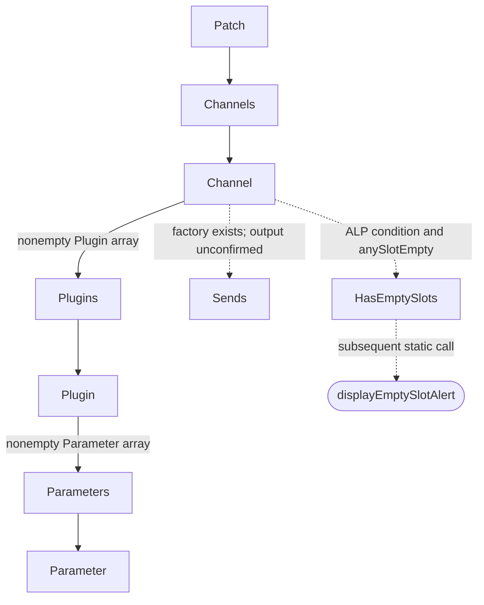

[日本語](SA-AE-XML-002-channel-node-schema.md) | [English](SA-AE-XML-002-channel-node-schema.en.md)

# SA-AE-XML-002 — Channel / Plugin / Parameter XML in mode 8

The mode 8 output candidate combines a `Patch / Channels` string wrapper with actual `Channel`, `Plugins`, `Plugin`, `Parameters`, and `Parameter` nodes. ARM64 and CFString payloads establish tag/attribute spelling, factory inputs, and empty-string omission. A `Sends` factory and conditional `HasEmptySlots` also exist; not every element is emitted on every path.

This records **static generation rules**. XML `id` is not established as a stable public ID, `value` as a UI value/unit, or every Channel as one UI track. Runtime output, reimport compatibility, completion, and failure remain unverified. Every TSV row has `runtime_verified=false` and `product_capability=false`.

The diagram shows generation relationships established in static code, not a runtime output example. Dotted edges mark conditional or unconfirmed output paths. The final alert is an additional statically observed call, not an XML node.

## Target and evidence

| Item | Value |
|---|---|
| Date / profile | 2026-10-02 / Logic Pro Creator Studio 12.3.1, build 6682 |
| Image / program | `Contents/Frameworks/Logic.framework/Versions/A/Logic` / `Logic.arm64`, thin ARM64 |
| Executable SHA-256 | `2f141e1a1f7b90a4fb0205ffec3dbe187baf601d20e9acb398acfadcdf050998` |
| Language / addresses | `AARCH64:LE:64:AppleSilicon` / unslid addresses in this image |
| Method | Bounded headless `-readOnly -noanalysis` exports. Instruction/data scripts and identity records check the stored program name/hash. No runtime calls, connections, or product changes |
| Provenance | [followup manifest](appleevent-followup-analysis-manifest.json), [binary identity](SA-IDENTITY-001-binary-inputs.en.md) |

See [SA-AE-MODES-001](SA-AE-MODES-001-text-operations.en.md) for entry points, block/iterator stores, and replies that do not report operation success. This report adds the downstream XML boundaries. Curated fields are in [appleevent-xml-fields.tsv](../protocol/appleevent-xml-fields.tsv). Local raw evidence:

- `Research/raw/ghidra/q-appleevent-xml-child-002.c`, `Research/raw/ghidra/q-appleevent-xml-child-002-machinecode.txt`, `Research/raw/ghidra/q-appleevent-xml-child-stubs-002-machinecode.txt`, `Research/raw/ghidra/q-appleevent-xml-child-strings-002.txt`.
- `Research/raw/ghidra/q-appleevent-xml-factories-002.c`, `Research/raw/ghidra/q-appleevent-xml-factories-002-machinecode.txt`, `Research/raw/ghidra/q-appleevent-xml-literals-002.txt`, `Research/raw/ghidra/q-appleevent-xml-method-metadata-002.txt`.
- `Research/raw/ghidra/q-appleevent-xml-alp-stubs-002-machinecode.txt`, `Research/raw/ghidra/q-appleevent-xml-alp-literals-002.txt`. Callers are in existing `Research/raw/ghidra/q-appleevent-xml-node-001-machinecode.txt` and `Research/raw/ghidra/q-appleevent-xml-block-001-machinecode.txt`.

## Selector-to-implementation mapping

The class-method list of category `AudioConfigurationExportExtension` is at `0x01bd2dd0`: header `0x8000000c`, count `6`, 12-byte entries. Adding each signed relative selector/type/IMP offset to **its own field address** yields the slots and IMPs below. Category list `0x024220b0 → 0x024f4250`, selector-slot strings, and 80 bytes of list data were checked. Absence from Ghidra function names or ordinary xrefs does not establish a missing implementation.

| Complete selector | Stub | Selector slot | Factory IMP |
|---|---|---|---|
| `MA_channelWithName:type:mode:filename:` | `0x01af4980` | `0x0253ee18` | `0x0154d0f8` |
| `MA_pluginsWithChildren:` | `0x01af4b40` | `0x0253ee88` | `0x0154d330` |
| `MA_pluginWithName:identifier:settingName:outputFormat:bypassed:` | `0x01af4b20` | `0x0253ee80` | `0x0154d35c` |
| `MA_parameterWithName:identifier:value:valueLimit:valueString:` | `0x01af4ae0` | `0x0253ee70` | `0x0154d600` |
| `MA_sendsWithChildren:` | `0x01af4b80` | `0x0253ee98` | `0x0154d8a4` |
| `MA_parametersWithChildren:` | `0x01af4b00` | `0x0253ee78` | `0x0154d8d0` |

Inputs after ObjC `x0=receiver, x1=selector` were traced in instructions. Channel has four inputs `x2…x5`; Plugin / Parameter have five `x2…x6`. Undefined `in_x7` and extra arguments in the child decompilation are not part of this schema.

## Confirmed tags and attributes

Factories call `attributeWithName:stringValue:` and `elementWithName:children:attributes:`. This table comes from those calls' CFStrings and payloads, not inferred selector names. Attribute order is factory array-addition order, not a measured final XML byte order.

| Tag | Attributes | Element-construction call |
|---|---|---|
| `Channel` | `name`, `type`, `mode`, `filename` | `0x0154d284` |
| `Plugins` | None; receives the supplied children | `0x0154d348` |
| `Plugin` | `id`, `name`, `settingName`, `outputFormat`, `bypassed` | `0x0154d53c` |
| `Parameter` | `id`, `name`, `value`, `valueLimit`, `valueString` | `0x0154d7e0` |
| `Sends` | None; receives the supplied children | `0x0154d8bc` |
| `Parameters` | None; receives the supplied children | `0x0154d8e8` |

Each attribute is added only if the input NSString's `length` is **nonzero**. Channel branches are `0x0154d178/0x0154d1b8/0x0154d1f8/0x0154d238`; Plugin branches `0x0154d3f0/0x0154d430/0x0154d470/0x0154d4b0/0x0154d4f0`; Parameter branches `0x0154d694/0x0154d6d4/0x0154d714/0x0154d754/0x0154d794`. Nil / empty strings are omitted; string **`"0"` is included**. These factories contain no whitespace trimming or numeric-zero rejection.

## Values supplied by mode 8

Channel caller `0x0154d8fc → 0x0154d9c8` supplies name, type label, mode label, and an empty filename. Name comes from the upper caller's NSString; if nil, internal object C string `+0x73` is converted with numeric encoding `0x1e`. Type uses unsigned short `((uint16 type & ~0x8)-0x40)` as its index: 0–6 map to `AudioTrack/Other/Aux/Instrument/Output/Bus/Master`, otherwise `Other`. Mode uses byte `+0x89`: 0–4 map to `Mono/Stereo/Left/Right/Surround`, otherwise empty. **The filename attribute is omitted for this caller because its input is empty**.

The ABI at Plugin caller `0x0154dcb4 → 0x0154dfe0` is below. XML field names are confirmed; internal fields' UI meanings and ID lifetimes are not. No mapping from XML `id` to Remote `gindex` / `instID` is established.

| XML field | Register | Actual source |
|---|---|---|
| `name` | `x2` | UTF-8 at child `+0x9a` → NSString |
| `id` | `x3` | Child uint32 `+0xbc`, formatted with `%d` |
| `settingName` | `x4` | UTF-8 at child `+0x28` → NSString |
| `outputFormat` | `x5` | Child byte `+0x6e`: 1=`Mono`, 2=`Stereo`, 3–14=`Surround`, otherwise empty |
| `bypassed` | `x6` | Bit 0 of child uint16 `+0x8a`, formatted with `%d` (`0` / `1`) |

The mode table is `0x02326280–0x023262e8`; formats are CFString `0x0233a1a8 = %d` and `0x02339cc8 = %ld`. Plugin outputFormat and Channel mode use **different inputs and different tables**.

Parameter inputs at `0x0154df7c` are below. The backend is the object at linked-entry `+0x120`. Nil parent, parent `+0x48 > 12`, missing resolver/linked entry/backend, or virtual count `<=0` still proceed to the Plugin factory with an empty Parameter array.

| XML field | Register | Actual source |
|---|---|---|
| `name` | `x2` | Returned object from backend virtual slot `+0x40` |
| `id` | `x3` | Loop index starting at 0, formatted with `%d` |
| `value` | `x4` | Return from virtual slot `+0x98`, formatted with `%ld` |
| `valueLimit` | `x5` | Return from virtual slot `+0x88`, formatted with `%ld` |
| `valueString` | `x6` | Buffer supplied to virtual slot `+0x50` with capacity `0x100` → UTF-8 NSString |

Virtual `+0x28` receives code `0x205` for count. Each index is passed to virtual calls as signed 16-bit. A **zero raw return from `+0x88` omits the entire Parameter** (`0x0154de9c`). `+0x50` receives backend, index, the `+0x98` value, capacity, and buffer; nonzero return omits the Parameter (`0x0154df4c`). Distinguish this from a factory accepting string `"0"`. Value units/scale, valueLimit definition, and valueString display rules remain unresolved.

## Children and conditional ALP processing

Two Channel groups use signed counts `+0x4e/+0x4c` and pointer bounds `+0x30/+0x38`. With type bit `0x40`, type `!=0xc0`, a valid index and child pointer, they call `0x0154dcb4` and collect non-null Plugins. A nonempty collection becomes `Plugins`, added at `0x0154db44`. A Plugin's nonempty Parameter array becomes `Parameters`, added at `0x0154e024`. The following `+0x4a` group adds nothing to its array in this node body; the Sends-addition code is gated by nonzero count. **Separate factory existence from output on this path**.

A nonzero `_IsALPCheckForEmptySlots` result (`0x0154dbfc`) calls `checkForEmptySlots:channelXMLElement:` → `0x0133d5a0`. The follow-up [XML-003](SA-AE-XML-003-empty-slot-alert.en.md) identifies the MACore predicate and cached preferences; current values and global writers remain unverified, so no runtime enabled/disabled state is assumed. The checker scans three groups (`+0x4e/+0x4c/+0x4a`) and calls `checkSlot:lastSlotEmpty:anySlotEmpty:` (stub `0x01b16720`) with slot and two local byte pointers. It resets lastSlotEmpty between groups while preserving anySlotEmpty.

If anySlotEmpty bit 0 is set, `0x0133d754` creates **`HasEmptySlots`** (CFString `0x023ebe08`, payload `0x01e11e8a`, length `13`) without children/attributes, adds it to Channel (`0x0133d76c`), and then calls **`displayEmptySlotAlert`** (stub `0x01b2cd80`, call `0x0133d77c`). [XML-003](SA-AE-XML-003-empty-slot-alert.en.md) confirms detection of non-null after null within a group, including a leading gap, and a call to `NSAlert.runModal` when bit 0 of a separate suppression flag is 0. No alert was observed at runtime; the static calls also do not support classifying XML generation as a pure getter.

No direct store updates input internal objects in the examined node/child/factory bodies. However, upstream mode 8 stores at `record+0x12`, iterator `song+0x658`, and `entry+0x6b4/+0x30` are already known; virtual-call and ALP side effects are unresolved. XML readability alone does not establish a read-only operation or product capability.

## Finite next gates and verification conditions

| Gate | Target and acceptance condition |
|---|---|
| X1: backend meaning | Identify concrete implementations of virtual `+0x28/+0x98/+0x88/+0x40/+0x50`; establish value/valueLimit types/units, count/index, buffer failure and termination |
| X2: ALP condition and side effects | [XML-003](SA-AE-XML-003-empty-slot-alert.en.md) establishes the predicate, slot rule, suppression and modal call. Remaining work: menu global / setter callers, current values, cache update/invalidation |
| X3: output-difference design | Independently vary empty string versus `"0"`, type/mode boundaries, raw valueLimit 0, buffer return 0/nonzero, and empty groups; distinguish omitted attributes, missing Parameters, and missing wrappers |
| X4: session-authorized experiments | `LogicCLI-Test.logicx`, dedicated output paths, one changed condition with multiple values/tracks, independent XML and before/after-state readback; include stores/alerts/failure/overwrite, otherwise `verified:false`. Preserve the separate PLAN-05 connection gate |

This establishes constructible structures and static field sources. A full state snapshot, stable operation IDs, complete plugin/parameter coverage, reimport schema, or operation-success contract remains unestablished.
