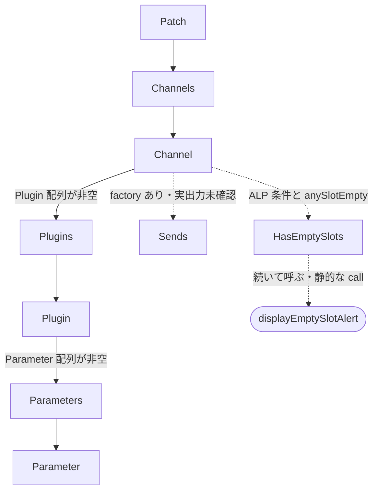

[日本語](SA-AE-XML-002-channel-node-schema.md) | [English](SA-AE-XML-002-channel-node-schema.en.md)

# SA-AE-XML-002 — mode 8 の Channel / Plugin / Parameter XML

mode 8 の出力候補は、`Patch / Channels` の文字列 wrapper に、実際の `Channel`、`Plugins`、`Plugin`、`Parameters`、`Parameter` node を組み合わせる。tag と attribute の大文字・小文字、factory の引数、空文字列を省く条件を、ARM64 と CFString 本体で確認した。`Sends` factory と条件付き `HasEmptySlots` も存在するが、すべてが毎回出力されるわけではない。

これは **静的な生成規則**の記録である。XML 内の `id` が安定した公開 ID、`value` が UI の値や単位、各 Channel が一つの UI track であるとは確定していない。実行時の出力、再インポート互換性、完成・失敗は未検証。全 TSV 行は `runtime_verified=false`、`product_capability=false`。

図は静的コードで確認した生成関係であり、実行時の出力例ではない。点線は条件付きまたは実出力未確認の経路。末尾の alert は XML node ではなく、静的に確認した追加 call を示す。

## 対象と証拠

| 項目 | 内容 |
|---|---|
| 日付 / profile | 2026-10-02 / Logic Pro Creator Studio 12.3.1、build 6682 |
| image / program | `Contents/Frameworks/Logic.framework/Versions/A/Logic` / `Logic.arm64`、thin ARM64 |
| Executable SHA-256 | `2f141e1a1f7b90a4fb0205ffec3dbe187baf601d20e9acb398acfadcdf050998` |
| language / address | `AARCH64:LE:64:AppleSilicon` / この image のスライド前アドレス |
| 方法 | headless `-readOnly -noanalysis` の限定出力。命令／data script と identity は保存済み program 名・hash を照合。実行時呼び出し、接続、製品変更なし |
| provenance | [followup manifest](appleevent-followup-analysis-manifest.json)、[binary identity](SA-IDENTITY-001-binary-inputs.md) |

入口、block、iterator の store、reply が操作成功を返さないことは [SA-AE-MODES-001](SA-AE-MODES-001-text-operations.md) を参照。本記録はその XML の下位境界を補足する。整理した field は [appleevent-xml-fields.tsv](../protocol/appleevent-xml-fields.tsv)。ローカル raw 証拠は以下。

- `Research/raw/ghidra/q-appleevent-xml-child-002.c`、`Research/raw/ghidra/q-appleevent-xml-child-002-machinecode.txt`、`Research/raw/ghidra/q-appleevent-xml-child-stubs-002-machinecode.txt`、`Research/raw/ghidra/q-appleevent-xml-child-strings-002.txt`。
- `Research/raw/ghidra/q-appleevent-xml-factories-002.c`、`Research/raw/ghidra/q-appleevent-xml-factories-002-machinecode.txt`、`Research/raw/ghidra/q-appleevent-xml-literals-002.txt`、`Research/raw/ghidra/q-appleevent-xml-method-metadata-002.txt`。
- `Research/raw/ghidra/q-appleevent-xml-alp-stubs-002-machinecode.txt`、`Research/raw/ghidra/q-appleevent-xml-alp-literals-002.txt`。caller は既存 `Research/raw/ghidra/q-appleevent-xml-node-001-machinecode.txt` と `Research/raw/ghidra/q-appleevent-xml-block-001-machinecode.txt`。

## selector から実装への対応

`AudioConfigurationExportExtension` category の class method list は `0x01bd2dd0`。header `0x8000000c`、count `6`、各 entry は 12 バイト。selector/type/IMP の各 signed relative offset を**その field 自身のアドレス**へ足すと、下表の slot と IMP が得られる。category list `0x024220b0 → 0x024f4250`、selector slot の文字列、80 バイトの list data を照合した。Ghidra の関数名や通常 xref に出ないことは、実装がない証拠ではない。

| 完全な selector | stub | selector slot | factory IMP |
|---|---|---|---|
| `MA_channelWithName:type:mode:filename:` | `0x01af4980` | `0x0253ee18` | `0x0154d0f8` |
| `MA_pluginsWithChildren:` | `0x01af4b40` | `0x0253ee88` | `0x0154d330` |
| `MA_pluginWithName:identifier:settingName:outputFormat:bypassed:` | `0x01af4b20` | `0x0253ee80` | `0x0154d35c` |
| `MA_parameterWithName:identifier:value:valueLimit:valueString:` | `0x01af4ae0` | `0x0253ee70` | `0x0154d600` |
| `MA_sendsWithChildren:` | `0x01af4b80` | `0x0253ee98` | `0x0154d8a4` |
| `MA_parametersWithChildren:` | `0x01af4b00` | `0x0253ee78` | `0x0154d8d0` |

ObjC の `x0=receiver, x1=selector` に続く入力を命令で追った。Channel は `x2…x5` の 4 個、Plugin / Parameter は `x2…x6` の 5 個。child の逆コンパイルに出る未定義 `in_x7` や余分な引数を schema に採用しない。

## 確定した tag と attribute

factory は `attributeWithName:stringValue:` と `elementWithName:children:attributes:` を呼ぶ。下表は selector 名からの推定ではなく、その call の CFString と payload の照合結果。表の順序は factory が配列に追加する順序であり、最終 XML の byte 順を実測したものではない。

| tag | attribute | factory 内の要素生成 call |
|---|---|---|
| `Channel` | `name`, `type`, `mode`, `filename` | `0x0154d284` |
| `Plugins` | なし。渡された children を保持 | `0x0154d348` |
| `Plugin` | `id`, `name`, `settingName`, `outputFormat`, `bypassed` | `0x0154d53c` |
| `Parameter` | `id`, `name`, `value`, `valueLimit`, `valueString` | `0x0154d7e0` |
| `Sends` | なし。渡された children を保持 | `0x0154d8bc` |
| `Parameters` | なし。渡された children を保持 | `0x0154d8e8` |

各 attribute は入力 NSString の `length` が **非ゼロの場合だけ**追加する。Channel の branch は `0x0154d178/0x0154d1b8/0x0154d1f8/0x0154d238`、Plugin は `0x0154d3f0/0x0154d430/0x0154d470/0x0154d4b0/0x0154d4f0`、Parameter は `0x0154d694/0x0154d6d4/0x0154d714/0x0154d754/0x0154d794`。nil / 空文字列は省略、文字列 **`"0"` は省略しない**。空白を trim したり数値 0 を拒否したりする検査はこの factory にない。

## mode 8 から渡す値

Channel caller `0x0154d8fc → 0x0154d9c8` は name、type label、mode label、空 filename を渡す。name は上位 caller の NSString、nil なら内部 object `+0x73` の C string を numeric encoding `0x1e` で変換する。type は unsigned short `((uint16 type & ~0x8)-0x40)` を index とし、0–6 は `AudioTrack/Other/Aux/Instrument/Output/Bus/Master`、範囲外は `Other`。mode は byte `+0x89` の 0–4 が `Mono/Stereo/Left/Right/Surround`、範囲外は空。**この caller の `filename` attribute は空のため省略される**。

Plugin caller `0x0154dcb4 → 0x0154dfe0` の ABI は次のとおり。XML field 名は確定しているが、内部 field の UI 上の意味・ID lifetime は未確定。XML の `id` を Remote の `gindex` / `instID` と対応付ける根拠もまだない。

| XML field | register | 実際の入力元 |
|---|---|---|
| `name` | `x2` | child `+0x9a` の UTF-8 → NSString |
| `id` | `x3` | child uint32 `+0xbc` を `%d` で文字列化 |
| `settingName` | `x4` | child `+0x28` の UTF-8 → NSString |
| `outputFormat` | `x5` | child byte `+0x6e`：1=`Mono`、2=`Stereo`、3–14=`Surround`、それ以外は空 |
| `bypassed` | `x6` | child uint16 `+0x8a` の bit 0 を `%d` で文字列化（`0` / `1`） |

mode table は `0x02326280–0x023262e8`、format は CFString `0x0233a1a8 = %d`、`0x02339cc8 = %ld`。Plugin の outputFormat と Channel の mode は**別の入力と別の table**である。

Parameter caller `0x0154df7c` の入力元は以下。backend は linked entry `+0x120` の object。親が nil、親 `+0x48 > 12`、resolver / linked entry / backend 不在、virtual count `<=0` でも、Parameter 配列を空のまま Plugin factory へ進む。

| XML field | register | 実際の入力元 |
|---|---|---|
| `name` | `x2` | backend virtual slot `+0x40` の戻り object |
| `id` | `x3` | 0 からの loop index を `%d` で文字列化 |
| `value` | `x4` | virtual slot `+0x98` の戻りを `%ld` で文字列化 |
| `valueLimit` | `x5` | virtual slot `+0x88` の戻りを `%ld` で文字列化 |
| `valueString` | `x6` | virtual slot `+0x50` が容量 `0x100` の buffer に渡した結果 → UTF-8 NSString |

virtual `+0x28` に code `0x205` を渡して count を得る。各 index は signed 16 ビットとして virtual 呼び出しに渡す。`+0x88` の raw return が **0 なら Parameter 全体を省く**（`0x0154de9c`）。`+0x50` に backend、index、`+0x98` の値、capacity、buffer を渡し、その return が非ゼロなら省く（`0x0154df4c`）。factory が文字列 `"0"` を含める規則とは区別する。value の単位・scale、valueLimit の定義、valueString の表示規則は未確定。

## children と条件付き ALP 処理

Channel の二つの group は signed count `+0x4e/+0x4c` と pointer 範囲 `+0x30/+0x38` を使う。type bit `0x40`、type `!=0xc0`、有効 index と child pointer を条件に `0x0154dcb4` を呼び、非 null Plugin をまとめる。非空なら `Plugins` を `addChild:`（`0x0154db44`）。Plugin の Parameter 配列が非空なら `Parameters` を `addChild:`（`0x0154e024`）。続く `+0x4a` の group はこの node 本体で配列へ何も追加せず、`Sends` の追加 branch は count 非ゼロ条件のコードとして存在する。**factory の存在と、この経路の実出力を分ける**。

`_IsALPCheckForEmptySlots`（`0x0154dbfc`）が非ゼロなら `checkForEmptySlots:channelXMLElement:` → `0x0133d5a0`。この feature 判定の実装・設定元は未調査で、既定の有効／無効は決めない。checker は 3 group（`+0x4e/+0x4c/+0x4a`）を走査し `checkSlot:lastSlotEmpty:anySlotEmpty:`（stub `0x01b16720`）へ slot と二つの local byte pointer を渡す。group 間で lastSlotEmpty を 0 に戻し、anySlotEmpty は保持する。

anySlotEmpty bit 0 が立つと、`0x0133d754` で **`HasEmptySlots`**（CFString `0x023ebe08`、payload `0x01e11e8a`、length `13`）を children / attributes なしで作り、Channel に追加（`0x0133d76c`）、その後 **`displayEmptySlotAlert`**（stub `0x01b2cd80`、call `0x0133d77c`）を呼ぶ。slot 判定の定義と alert の実装は未調査。実際に alert を表示したとは扱わないが、XML 生成を pure getter とする根拠もない。

今回の node / child / factory 本体に入力内部 object の直接 store は見えない。ただし上位 mode 8 の `record+0x12`、iterator の `song+0x658`・`entry+0x6b4/+0x30` store は既知であり、virtual call と ALP の副作用は未解決。XML field を読み取れることだけで read-only 操作や製品 capability に昇格させない。

## 次の有限 gate と検証条件

| gate | 確認対象・受け入れ条件 |
|---|---|
| X1: backend の意味 | virtual `+0x28/+0x98/+0x88/+0x40/+0x50` の具体的な実装を特定。value / valueLimit の型・単位、count・index、buffer の失敗・終端を確定 |
| X2: ALP 条件と副作用 | feature 判定、checkSlot、displayEmptySlotAlert の小さな entry/exit。設定値、空 slot の定義、global/UI/内部 object への変更を確定 |
| X3: 出力差の試験設計 | 空文字列と `"0"`、type / mode の境界、raw valueLimit 0、buffer return 0/非ゼロ、空 group を独立条件にする。省略 attribute、欠落 Parameter、欠落 wrapper を別々に確認 |
| X4: session で許可された実験 | `LogicCLI-Test.logicx`、専用出力先、1 条件ずつ複数値・複数 track、生成 XML と前後状態の独立読み戻し。store・alert・失敗・上書きも確認し、確認できなければ `verified:false`。PLAN-05 接続 gate は別に維持 |

この記録は生成可能な構造と静的な field の出所を示す。full state snapshot、安定した操作 ID、完全な plugin/parameter coverage、再インポート schema、操作成功という契約はまだ成立していない。
