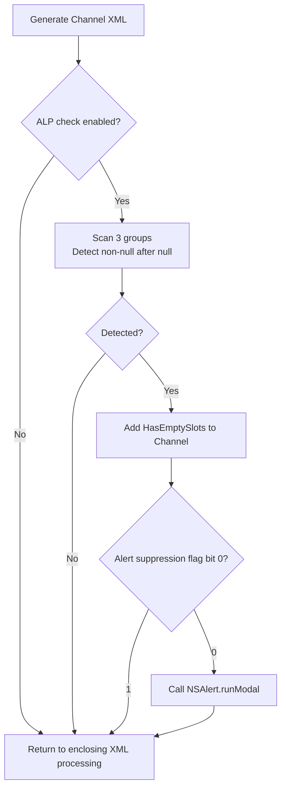

# SA-AE-XML-003: Empty-slot detection and alerts during XML generation

[日本語](SA-AE-XML-003-empty-slot-alert.md) · [English](SA-AE-XML-003-empty-slot-alert.en.md) · [XML fields](SA-AE-XML-002-channel-node-schema.en.md)

**Mode 8 XML generation has a conditional path calling a modal alert.** Adding `HasEmptySlots` and displaying the alert have separate conditions. The slot test detects a null pointer followed by a non-null pointer within the same group, including leading empty slots. These are static findings; no alert, current preference value, or generated XML was observed at runtime.

| Item | Value |
|---|---|
| Baseline | 2026-10-02, Logic Pro Creator Studio 12.3.1 / build 6682 |
| Logic ARM64 SHA-256 | `2f141e1a1f7b90a4fb0205ffec3dbe187baf601d20e9acb398acfadcdf050998` |
| MACore ARM64 SHA-256 | `99a4a9adbf79c92046682eb821d8ef35145f4915a29b88839c4f026ae63cd076` |
| Method | Ghidra `-noanalysis -readOnly`, ARM64, import symbols, CFString bytes. Addresses are unslid within their respective images |
| Provenance | [Native boundaries manifest](appleevent-native-boundaries-manifest.json), [binary identity](SA-IDENTITY-001-binary-inputs.en.md) |
| Runtime / product | No events, new connections, or preference changes. `runtime_verified=false`; no product capability added |

## 1. Separate the conditions

The Channel caller at `0x0154dbfc` calls Logic import stub `0x01aee3f0`; `cbz w0` at `0x0154dc00` skips checking. A nonzero result calls `checkForEmptySlots:channelXMLElement:` (`0x0154dc14`, static IMP `0x0133d5a0`). `nm -m` also identifies **MACore** as the provider of `_IsALPCheckForEmptySlots` and `_IsALPDisableDependencyAndPatchAlerts`. The Logic import stub is not the predicate implementation.

## 2. Exact null / non-null rule

The static IMP of `checkSlot:lastSlotEmpty:anySlotEmpty:` is `0x0133d574` (44 bytes). `x2` is the slot pointer, `x3` the lastSlotEmpty byte pointer, and `x4` the anySlotEmpty byte pointer.

| Input | Byte updates | Instructions |
|---|---|---|
| Null slot | lastSlotEmpty = 1; preserve anySlotEmpty | `0x0133d574`, `0x0133d594..0x0133d598` |
| Non-null slot, lastSlotEmpty == 1 | anySlotEmpty = 1; lastSlotEmpty = 0 | `0x0133d578..0x0133d590` |
| Non-null slot, lastSlotEmpty != 1 | Return without a change | `0x0133d57c..0x0133d580`, `0x0133d59c` |

The caller initializes both local bytes to 0 (`0x0133d5c4`) and resets only lastSlotEmpty between its three groups (`0x0133d64c`, `0x0133d6c4`). anySlotEmpty is preserved. The following examples explain the static rule of this small function; they are not runtime observations of Logic.

| Pointer sequence within a group | Detection |
|---|---|
| `[non-null, null, non-null]` | Yes |
| `[null, non-null]` | Yes, including a leading empty slot |
| `[non-null, null]` / `[null, null]` | No |
| Null at the end of group A, non-null at the start of group B | Insufficient by itself; last is reset between groups |

The checker uses signed counts `+0x4e/+0x4c/+0x4a`, type bit `0x40`, type `!=0xc0`, and pointer-array bounds `+0x30/+0x38`. A failed lookup condition can also supply null, so null is not established as a genuinely empty slot in the UI for all cases.

## 3. Preferences enabling the check

The addresses below are in **MACore.arm64**. Some decompiled C confuses returned values with incoming arguments; the register flow and comparisons take precedence.

| Function | Confirmed static condition |
|---|---|
| `_IsALPCheckForEmptySlots` `0x00070b8c` | Return 1 if `_IsALPModeLogic` bit 0 is set; otherwise tail-call `_IsALPModeGarageBandIOS` |
| `_IsALPModeLogic` `0x00070844` | With a nonzero `_IsALPMenuEnabled`, return 1 when the cached integer is 1 (`0x00070868..0x00070870`) |
| `_IsALPModeGarageBandIOS` `0x000708ec` | Under the same menu condition, return 1 when the cached integer is 2 (`0x00070910..0x00070918`) |
| `_IsALPMenuEnabled` `0x00070680` | Require global byte `0x001b59b0 == 1`, then return bit 0 of a cached preference; otherwise return 0 |
| Integer getter `0x00070994` | If `objectForKey:` on `NSUserDefaults.standardUserDefaults` is non-nil, read `integerForKey:` and store the result in the local cache |

The integer key is CFString `0x0018a080 → 0x00147e4e`, **`ALPContentAuthoringModeV2`** (length 25). The menu key is `0x0018a0a0 → 0x00147e68`, **`ALPContentAuthoringMenuEnabled`** (length 30). Cached defaults are mode 0 (`0x000708a8` / `0x00070950`) and menu 0 (`0x00070794`). First-use paths include construction, guards, atexit registration, and cache stores; these getters are not expressions without side effects.

Current defaults, the writer of the menu global byte, and cache update/invalidation paths remain unresolved. **This does not establish that the check is always disabled or cannot affect ordinary users.** No preference or setter was changed or executed.

## 4. XML addition and modal alert

With anySlotEmpty bit 0 set, the checker creates `HasEmptySlots` (`0x0133d754`), adds it to Channel (`0x0133d76c`), and calls `displayEmptySlotAlert` (`0x0133d77c`, static IMP `0x0133d49c`). This agrees with the prior XML record.

The alert's first call at `0x0133d4a8` is `_IsALPDisableDependencyAndPatchAlerts`. If result bit 0 is **1, it returns immediately** (`0x0133d4ac..0x0133d4b8`). This suppression does not undo the preceding `HasEmptySlots` addition. MACore getter `0x00070b74` reads global byte `0x001b59b2`; setter `0x00070b80` stores the low byte of `w0` there. Actual callers and the current value of the setter are unverified.

Without suppression it allocates `NSAlert`, sets message/informative text and style `2`, then **calls `runModal` at `0x0133d534`**. The main message is CFString `0x023ebdc8 → 0x01e11dd9`, length 32, `Empty Plugin/Send Slot detected.`. The informative text is `0x023ebde8 → 0x01e11dfa`, length 143. It describes a gap between two active slots, whereas the actual rule in §2 also includes leading gaps.

This alert body contains no direct store to an input track/slot object. XML node addition, Objective-C allocation, and a modal UI call are nevertheless confirmed boundaries. Upper mode 8 metadata stores are already documented in [MODES-001](SA-AE-MODES-001-text-operations.en.md).

## 5. Remaining conditions for an agent API

Mode 8 does not meet the conditions for publication as a pure state getter. An external timeout does not confirm dismissal of the alert, completion of XML, or cancellation of the operation; the common `sPer=0` reply does not guarantee helper success. Product admission needs UI waiting, independent readback, and unknown outcomes to agree with the [execution contract](../../docs/execution-contract.en.md).

1. Bound the menu global / alert suppression setter callers and cached preference update conditions statically.
2. Establish when a null group lookup corresponds to an empty UI slot and identify concrete backend parameter implementations.
3. If designing a dedicated-project experiment, compare leading/interior/trailing gaps, group boundaries, check and suppression conditions one at a time; independently read back XML and before/after state. This record performs no such execution.

Local raw evidence comprises the `q-appleevent-native-next-003`, `q-appleevent-xml-alert-literals-003`, `q-appleevent-xml-feature-flags-003`, `q-appleevent-xml-feature-owner-003`, `q-appleevent-xml-feature-preferences-003`, and `q-appleevent-xml-menu-key-003` outputs. Earlier checker / Channel caller evidence is in the follow-up manifest. Full raw output and binaries are excluded from Git.
