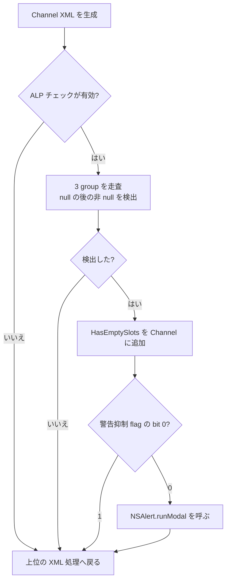

# SA-AE-XML-003: 空スロットの判定と XML 生成中の警告

[日本語](SA-AE-XML-003-empty-slot-alert.md) · [English](SA-AE-XML-003-empty-slot-alert.en.md) · [XML の項目](SA-AE-XML-002-channel-node-schema.md)

**mode 8 の XML 生成には、条件付きでモーダル警告を呼ぶ経路があります。** `HasEmptySlots` の追加と警告表示は別の条件です。slot の判定は「同じ group 内で null の後に非 null が来る」で、先頭の空 slot も検出します。これは静的解析の結果で、警告の表示・現在の設定値・生成 XML を実機で観測したものではありません。

| 項目 | 内容 |
|---|---|
| 基準 | 2026-10-02、Logic Pro Creator Studio 12.3.1 / build 6682 |
| Logic ARM64 SHA-256 | `2f141e1a1f7b90a4fb0205ffec3dbe187baf601d20e9acb398acfadcdf050998` |
| MACore ARM64 SHA-256 | `99a4a9adbf79c92046682eb821d8ef35145f4915a29b88839c4f026ae63cd076` |
| 方法 | Ghidra `-noanalysis -readOnly`、ARM64、import symbol、CFString の照合。アドレスは各 image の slide 前 |
| 再現資料 | [native boundaries manifest](appleevent-native-boundaries-manifest.json)、[binary identity](SA-IDENTITY-001-binary-inputs.md) |
| 実機・製品 | イベント送信・新規接続・設定変更なし。`runtime_verified=false`、製品 capability の追加なし |

## 1. 条件を分けて読む

Channel caller `0x0154dbfc` は Logic の import stub `0x01aee3f0` を呼び、`0x0154dc00` の `cbz w0` でチェックを省きます。非ゼロなら `checkForEmptySlots:channelXMLElement:`（`0x0154dc14`、static IMP `0x0133d5a0`）へ進みます。`nm -m` でも `_IsALPCheckForEmptySlots` と `_IsALPDisableDependencyAndPatchAlerts` の供給元が **MACore** であることを照合しました。Logic の import stub を判定の本体とは扱いません。

## 2. null / 非 null の具体的な判定

`checkSlot:lastSlotEmpty:anySlotEmpty:` の static IMP は `0x0133d574`（44 bytes）。`x2=slot pointer`、`x3=lastSlotEmpty の byte pointer`、`x4=anySlotEmpty の byte pointer` です。

| 入力 | byte の変更 | 命令 |
|---|---|---|
| slot が null | lastSlotEmpty = 1。anySlotEmpty は保持 | `0x0133d574`、`0x0133d594..0x0133d598` |
| slot が非 null、lastSlotEmpty == 1 | anySlotEmpty = 1、lastSlotEmpty = 0 | `0x0133d578..0x0133d590` |
| slot が非 null、lastSlotEmpty != 1 | 変更せず戻る | `0x0133d57c..0x0133d580`、`0x0133d59c` |

caller は local 2 bytes を最初に 0 にし（`0x0133d5c4`）、3 group の間では lastSlotEmpty だけを 0 に戻します（`0x0133d64c`、`0x0133d6c4`）。anySlotEmpty は保持します。以下はこの小関数の静的規則を説明する例で、Logic の実行結果ではありません。

| 同じ group の pointer 列 | 検出 |
|---|---|
| `[非 null, null, 非 null]` | あり |
| `[null, 非 null]` | あり。先頭の空 slot も対象 |
| `[非 null, null]` / `[null, null]` | なし |
| group A の末尾が null、group B の先頭が非 null | それだけでは検出しない。group 間で last を reset |

checker は signed count `+0x4e/+0x4c/+0x4a`、type bit `0x40` と type `!=0xc0`、pointer 配列 `+0x30/+0x38` の bounds を使います。条件を満たさない lookup も null を小関数へ渡し得るため、「null = UI の本当に空の slot」と一般化しません。

## 3. チェックを有効にする設定経路

以下のアドレスは **MACore.arm64** 内です。Ghidra の C には引数を戻り値と取り違える箇所があるため、`w0/x0` と比較命令を優先しました。

| 関数 | 静的に確認した条件 |
|---|---|
| `_IsALPCheckForEmptySlots` `0x00070b8c` | `_IsALPModeLogic` の bit 0 が 1 なら 1。それ以外は `_IsALPModeGarageBandIOS` へ tail call |
| `_IsALPModeLogic` `0x00070844` | `_IsALPMenuEnabled` 非ゼロのとき、cached integer が 1 なら 1（`0x00070868..0x00070870`） |
| `_IsALPModeGarageBandIOS` `0x000708ec` | 同じ menu 条件で、cached integer が 2 なら 1（`0x00070910..0x00070918`） |
| `_IsALPMenuEnabled` `0x00070680` | global byte `0x001b59b0 == 1` かつ cached preference の bit 0。global が異なるなら 0 |
| integer getter `0x00070994` | `NSUserDefaults.standardUserDefaults` の `objectForKey:` が非 nil なら `integerForKey:` を読み、local cache に保存 |

integer key は CFString `0x0018a080 → 0x00147e4e` の **`ALPContentAuthoringModeV2`**（length 25）。menu key は `0x0018a0a0 → 0x00147e68` の **`ALPContentAuthoringMenuEnabled`**（length 30）。cached preference の初期値は mode 0（`0x000708a8` / `0x00070950`）、menu 0（`0x00070794`）です。初回参照では constructor、guard、atexit 登録、cache store があり、これらの getter も全く副作用のない式ではありません。

現在の defaults、global byte の設定元、cache 更新通知・無効化経路は未調査です。**設定が常に無効、または一般ユーザーには発生しないとは判断しません。** preference の書き換えや setter の実行は行っていません。

## 4. XML 追加とモーダル警告

anySlotEmpty の bit 0 が立つと、checker は `HasEmptySlots` を生成（`0x0133d754`）、Channel へ追加（`0x0133d76c`）、`displayEmptySlotAlert` を呼びます（`0x0133d77c`、static IMP `0x0133d49c`）。この順序は先行 XML 記録と一致します。

alert の最初の call `0x0133d4a8` は `_IsALPDisableDependencyAndPatchAlerts`。その戻り値の bit 0 が **1 なら直ちに戻る**（`0x0133d4ac..0x0133d4b8`）。この抑制が `HasEmptySlots` の追加を取り消す経路はありません。MACore の getter `0x00070b74` は global byte `0x001b59b2` を読むだけ、setter `0x00070b80` は `w0` の下位 byte を同じ場所へ保存するだけです。setter の実際の呼び出し元・現在値は未確認です。

抑制しない場合、`NSAlert` を作り、message / informative text と style `2` を設定し、**`0x0133d534` で `runModal` を呼びます**。主文の CFString は `0x023ebdc8 → 0x01e11dd9`、length 32、`Empty Plugin/Send Slot detected.`。説明文は `0x023ebde8 → 0x01e11dfa`、length 143。説明文は二つの有効 slot の間の空きを述べますが、判定は §2 のとおり先頭の空きも含みます。

この alert 本体に入力 track / slot object への直接 store はありません。ただし XML node の追加、Objective-C の allocation、modal UI call は確定した境界です。上位 mode 8 の metadata store も [MODES-001](SA-AE-MODES-001-text-operations.md) に記録済みです。

## 5. エージェント用 API に進むための残り

mode 8 を純粋な状態取得 API として公開する条件は満たしていません。外部 timeout は alert が閉じたこと、XML が完成したこと、操作が取り消されたことの確認にはならず、共通 reply の `sPer=0` も helper の成功を保証しません。製品へ入れる場合は、UI 待機・読み戻し・結果不明の扱いを [実行契約](../../docs/execution-contract.md) と整合させる必要があります。

1. menu global と警告抑制 setter の呼び出し元、cached preference の更新条件を静的に限定して追う。
2. group lookup の null が UI の空 slot と一致する条件と、backend parameter の具体的な実装を確認する。
3. 専用曲の実験を設計する場合、先頭の空き／中間の空き／末尾の空き、group 境界、チェック・抑制の各条件を一つずつ比較し、XML と前後状態を独立に読み戻す。実行はこの記録では行わない。

ローカル raw 根拠は `q-appleevent-native-next-003`、`q-appleevent-xml-alert-literals-003`、`q-appleevent-xml-feature-flags-003`、`q-appleevent-xml-feature-owner-003`、`q-appleevent-xml-feature-preferences-003`、`q-appleevent-xml-menu-key-003` の各出力です。先行 checker / Channel caller は follow-up manifest に記録済み。完全な raw・バイナリは Git に含めません。
