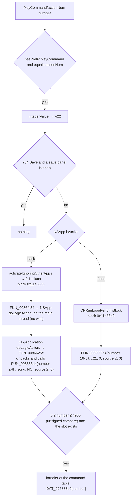

[日本語](SA-REMOTE-KEYCOMMAND-001.md) | [English](SA-REMOTE-KEYCOMMAND-001.en.md)

# SA-REMOTE-KEYCOMMAND-001 — the number in `/keyCommand/actionNum` is the command catalog's `command_id`

| Item | Value |
|---|---|
| Status | **Static analysis only.** Nothing was sent to Logic. No new Ghidra job either (the saved decompilation and `llvm-objdump` on the image file) |
| Date | 2026-10-05 |
| Subject | Logic 12.3.1 (6682), the arm64 `Logic.arm64` (SHA-256 `2f141e1a…0998`) |
| Evidence | [Anchor table](../protocol/logic-remote-keycommand-anchors.tsv) (113 rows, checked against the binary), `Research/raw/ghidra/q-p7-route.c` (not tracked by Git) |
| Related | [SA-COMMAND-CATALOG-001](SA-COMMAND-CATALOG-001.en.md) (the catalog) · [SA-004](SA-004-command-and-engine-boundaries.en.md) (the common dispatcher) · [operation-catalog.tsv](../protocol/operation-catalog.tsv) |

## 1. Conclusions

| Item | Conclusion | Kind | Confidence |
|---|---|---|---|
| What the number is | With Logic in front, the argument (an integer) of `/keyCommand/actionNum`, **cut to 16 bits**, is passed as `befehl` to the common command dispatcher `FUN_008663d4`: the same number as `command_id` in [operation-catalog.tsv](../protocol/operation-catalog.tsv) | Static fact (instructions) | High |
| Path | In front and in the back alike, the **same dispatcher** as the menus, toolbar and Accessibility, with `source` 2. In the back it goes through `CLgApplication doLogicAction:` → `FUN_0086625c` (repacked into a `keyLogicAction*` dictionary, then called with the same arguments) | Static fact (instructions; the background path was read on 2026-10-07) | High |
| Range | The number is taken as **signed 16 bits** (`ldrsh`) and the dispatcher compares it **unsigned** with 4950 (0x1356) (`b.hi`). Only **0 ≤ number ≤ 4950** after the cut runs; negative values are refused too. It is not the integer as sent: 65539 (0x10003), for example, becomes 3 (Play) | Static fact | High |
| Special case | **Only 754 (Save)** is skipped while a save panel (`NSSavePanel`) is the modal window. But that check compares the **32-bit value before the cut** (`cmp w22, #0x2f2`): sending 66290 (0x102F2) passes the check and can run as 754 (Save) after the cut | Static fact (read from how the instructions combine; not tried by sending) | High |
| Reply | The router **only queues** the command: it does not wait for the result and sends no reply to the Remote. Whether it worked can only be told by reading the state again | Static fact (within this branch) | High |
| Hidden commands | This branch does **not** consult `suppressedKeyCommands` (the 100 commands hidden from the Remote's list). A number missing from the list is not stopped here | Static fact (within this branch; whether a deeper check exists in the dispatcher is unread) | Medium |

## 2. The path



- **Logic in front** (anchors `KC-enqueue`, `BLK-active`): a block capturing the number and `x21` is queued on the main run loop. The block reads the number as signed 16 bits and calls `FUN_008663d4(number, x21, 0, 2, 0)`. The fourth argument (`source`) is **2**. SA-004 said "`source` 2 is the Notes link"; **the Remote's `actionNum` uses 2 as well**.
- **Logic in the back** (`BLK-inactive`, `DEF-perform`): Logic is brought to the front and, 0.1 s later, `FUN_00864f34(number, x21, 0, 0, 0, 0)` is called. It packs 7 values into a dictionary (`keyLogicActionNum`, `SongID`, `IgnoreFeatureAvailability`, `KeyUp`, `TrackID`, `DontLearn`, `CalledFromControlSurface`) and, if `NSApp` responds to `doLogicAction:`, has it performed **on the main thread without waiting**. `doLogicAction:` of `NSApp`'s class `CLgApplication` is two instructions that jump to `FUN_0086625c`, which unpacks the dictionary and calls `FUN_008663d4(number sign-extended from 16 bits (sxth), song (only an active one, +0x85c == 1), IgnoreFeatureAvailability, 4 if KeyUp else 2, TrackID)`. On `actionNum`'s background path `IgnoreFeatureAvailability` is always NO and `KeyUp`, `TrackID`, `DontLearn`, `CalledFromControlSurface` are 0, so **the source is 2, as on the front path** (anchors `BG-*`).
- **Dispatcher** (`DISP-range`): `cmp w22, #0x1356` and `b.hi` (an unsigned compare) drop numbers above 4950 and sign-extended negative numbers, and an empty `DAT_026883b0[number]` does nothing (matches SA-004's "`befehl < 0x1357`").

What `x21` points to (the dispatcher's second argument; the song in SA-004) is not traced within this branch.

## 3. Relation to the catalog

- A catalog `command_id` (0 to 4950) is the `actionNum` number as it is (on the front path). For example 754 is `Save` and 3 is `Play` in the catalog. The integer sent is cut to 16 bits, so an out-of-range integer can alias another command (65539 → 3).
- The catalog's `remote_offered` column (whether the Remote's list shows it) is **about the list, not about whether it can run**. This branch does not stop commands hidden from the list (§1).
- **Not a permission to run anything**: like the catalog, this note is only a map of which number calls what. The handlers' state checks (the mode 0x8000 call and the like) and side effects have to be read per command (PLAN-10).

## 4. What it means for the product (hypothesis)

- Sending `actionNum` over the Remote route **may** run commands that have no MCU assignment, by their catalog number. However:
  - **There is no reply**, so whether it ran must be confirmed by reading the state again (this project's "a write is confirmed by reading back").
  - The number is cut to 16 bits, so the sender must keep it within 0 to 4950 (otherwise another command can run).
  - A Logic in the back is **brought to the front** (`activateIgnoringOtherApps`), which can disturb the user's work.
- Actually sending is a new experiment (with sending) and needs separate approval. Nothing was sent for this note.

## 5. Unresolved

| Item | State |
|---|---|
| The body of `doLogicAction:` (the path when Logic is in the back), and whether it reaches the same dispatcher | **Resolved** (2026-10-07): `CLgApplication doLogicAction:` → `FUN_0086625c` → `FUN_008663d4` (`source` 2). `RemoteCommandSupport` also has a `doLogicAction:` (a short argument, for Notes links), but `NSApp` receives it on the `CLgApplication` side |
| What `x21` points to | Not confirmed within this branch |
| Per-command checks deeper in the dispatcher (`FUN_00865cec`) | SA-004's scope; not analysed per command |
| Behaviour when actually sent | Unconfirmed (sending needs approval) |

## 6. Reproduce

```sh
python3 Tools/research-scripts/binary_anchors.py check Research/protocol/logic-remote-keycommand-anchors.tsv
xcrun llvm-objdump -d --start-address=0x11e0eb0 --stop-address=0x11e1158 <Logic.arm64>
```
