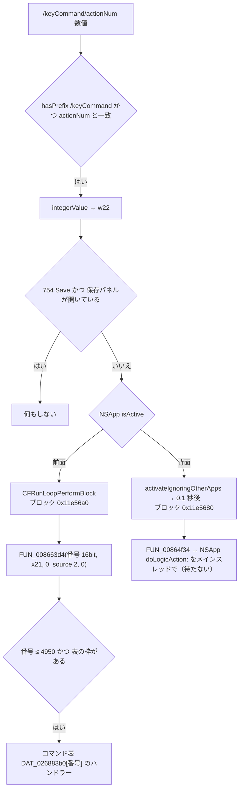

[日本語](SA-REMOTE-KEYCOMMAND-001.md) | [English](SA-REMOTE-KEYCOMMAND-001.en.md)

# SA-REMOTE-KEYCOMMAND-001 — `/keyCommand/actionNum` の番号は、コマンド台帳の `command_id` そのもの

| 項目 | 内容 |
|---|---|
| 状態 | **静的解析のみ**。Logic には何も送っていない。Ghidra の新しいジョブも使っていない（保存済みの逆コンパイル結果と、画像ファイルの `llvm-objdump`） |
| 日付 | 2026-10-05 |
| 対象 | Logic 12.3.1 (6682)、arm64 の `Logic.arm64`（SHA-256 `2f141e1a…0998`） |
| 根拠 | [アンカー表](../protocol/logic-remote-keycommand-anchors.tsv)（80 行、画像から照合）、`Research/raw/ghidra/q-p7-route.c`（Git の追跡対象外） |
| 関連 | [SA-COMMAND-CATALOG-001](SA-COMMAND-CATALOG-001.md)（台帳）・[SA-004](SA-004-command-and-engine-boundaries.md)（共通のディスパッチャー）・[operation-catalog.tsv](../protocol/operation-catalog.tsv) |

## 1. 結論

| 項目 | 結論 | 区分 | 確信度 |
|---|---|---|---|
| 番号の意味 | `/keyCommand/actionNum` の引数（整数）は、**共通のコマンド・ディスパッチャー `FUN_008663d4` の `befehl` にそのまま渡る**。つまり [operation-catalog.tsv](../protocol/operation-catalog.tsv) の `command_id` と同じ番号 | 静的事実（命令） | 高 |
| 通る経路 | メニュー・ツールバー・Accessibility と**同じ**ディスパッチャー。Remote 専用の実行経路は無い | 静的事実（SA-004 と本書） | 高 |
| 範囲 | 番号は**符号付き 16 ビット**として取り出され（`ldrsh`）、ディスパッチャーは 4950（0x1356）を超える番号と空の枠を実行しない | 静的事実 | 高 |
| 特別扱い | **754（Save）だけ**、保存パネル（`NSSavePanel`）がモーダルで開いているときは実行しない | 静的事実 | 高 |
| 返事 | ルーターは実行を**キューに積むだけ**で、結果を待たず、Remote への応答も送らない。成功したかどうかは、状態を読み直すしか分からない | 静的事実（この分岐の範囲） | 高 |
| 隠すコマンド | この分岐は `suppressedKeyCommands`（Remote の一覧から隠す 100 個）を**見ていない**。一覧に出ない番号でも、ここでは止まらない | 静的事実（この分岐の範囲。ディスパッチャーの奥で別の検査があるかは未読） | 中 |

## 2. 経路



- **前面のとき**（アンカー `KC-enqueue`、`BLK-active`）：番号と `x21` を捕捉したブロックを、メインのランループに積む。ブロックは番号を符号付き 16 ビットで読み、`FUN_008663d4(番号, x21, 0, 2, 0)` を呼ぶ。第 4 引数（`source`）は **2**。SA-004 は「`source` 2 は Notes のリンク」と書いていたが、**Remote の `actionNum` も 2 を使う**。
- **背面のとき**（`BLK-inactive`、`DEF-perform`）：Logic を前面に出し、0.1 秒後に `FUN_00864f34(番号, x21, 0, 0, 0, 0)` を呼ぶ。これは値を 7 個詰めた辞書を作り、`NSApp` が `doLogicAction:` に応答すれば、それを**メインスレッドで、待たずに**実行させる。`doLogicAction:` の本体は読んでいない。
- **ディスパッチャー**（`DISP-range`）：`cmp w22, #0x1356` と `b.hi` で 4950 を超える番号を外し、`DAT_026883b0[番号]` が空なら何もしない（SA-004 の「`befehl < 0x1357`」と一致）。

`x21` が何を指すか（ディスパッチャーの第 2 引数。SA-004 では song）は、この分岐の中では辿っていない。

## 3. 台帳との関係

- 台帳の `command_id` は、そのまま `actionNum` の番号になる。たとえば台帳の 754 は `Save`、3 は `Play`。
- 台帳の `remote_offered` 列（Remote の一覧に出るか）は、**一覧の話で、実行の可否ではない**。この分岐は一覧から隠したコマンドも止めない（§1）。
- **実行の許可ではない**：台帳と同じく、本書は「どの番号が何を呼ぶか」の地図にすぎない。ハンドラーの状態の検査（モード 0x8000 の呼び出しなど）や副作用は、コマンドごとに別に読む必要がある（PLAN-10）。

## 4. 製品への含意（仮説）

- Remote の経路で `actionNum` を送れば、MCU に割り当ての無いコマンドも、台帳の番号で実行できる**可能性がある**。ただし、
  - **返事が無い**ので、実行されたかは状態を読み直して確かめる必要がある（このプロジェクトの「書き込みは読み戻しで確認」の原則）。
  - 番号が 16 ビットに切り詰められるので、送る側で 0〜4950 に限る必要がある。
  - 背面の Logic は**前面に出される**（`activateIgnoringOtherApps`）。ユーザーの作業を妨げうる。
- 実際に送るのは、新しい実験（送信を含む）として、別途承認が要る。本書は何も送っていない。

## 5. 不明なこと

| 項目 | 状態 |
|---|---|
| `doLogicAction:`（背面のときの経路）の本体と、最終的に同じディスパッチャーに届くか | 未読 |
| `x21` が何を指すか | この分岐の中では未確認 |
| ディスパッチャーの奥（`FUN_00865cec`）での、コマンドごとの実行可否の検査 | SA-004 の範囲。コマンドごとには未解析 |
| 実際に送ったときの振る舞い | 未確認（送信は承認が要る） |

## 6. 再現

```sh
python3 Tools/research-scripts/binary_anchors.py check Research/protocol/logic-remote-keycommand-anchors.tsv
xcrun llvm-objdump -d --start-address=0x11e0eb0 --stop-address=0x11e1158 <Logic.arm64>
```
