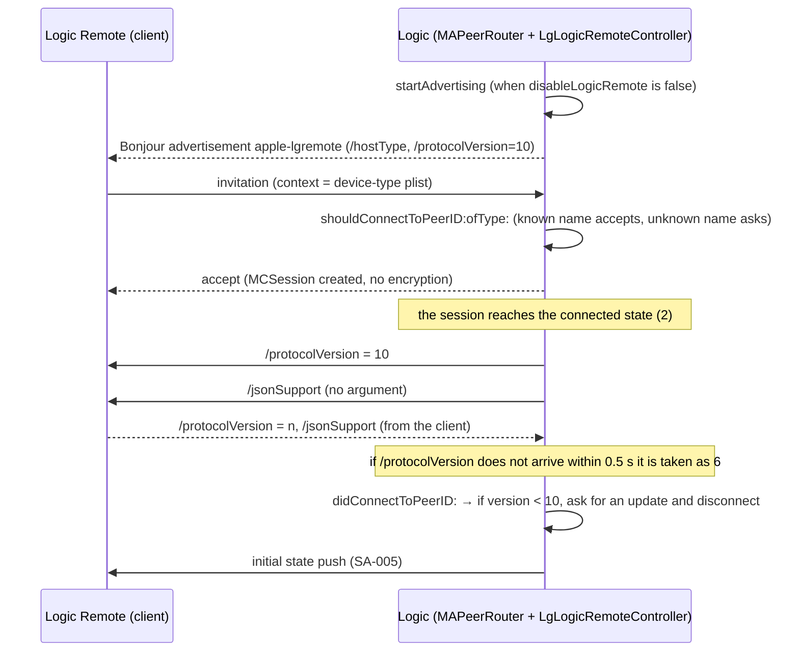

[日本語](SA-REMOTE-SESSION-001.md) | [English](SA-REMOTE-SESSION-001.en.md)

# SA-REMOTE-SESSION-001: The Logic Remote connection — advertising, invitation, approval and version order

| Item | Value |
|---|---|
| Date | 2026-10-02 |
| Logic | 12.3.1 (6682), macOS 27.0 |
| Binaries (arm64) | `MACore.framework` (universal whole file SHA-256 `76ab2a5f…`, arm64 slice `99a4a9ad…`), `Logic.framework` (arm64 only, `2f141e1a…`) |
| Method | **Static only.** Targeted Ghidra 12.1.4 decompilation (`Tools/ghidra/query.sh`). Nothing was sent to Logic and no connection was made |
| Output (local only) | `Research/raw/ghidra/q-p3-macore.c`, `q-p3-macore2.c`, `q-p3-logic.c` |
| Related | [SA-002](SA-002-control-surface-assign-model.en.md) (message format), [SA-005](SA-005-logic-remote-state-push.en.md) (state push after connecting) |

**Confidence convention:** what matches the decompiled code is "confirmed"; inferences from it are "hypothesis".
Nothing here is confirmed on the wire.

## 1. The whole order

## 2. Advertising (Logic side)

| Item | What was confirmed | Evidence |
|---|---|---|
| Start condition | The user default `disableLogicRemote` is false | `LgLogicRemoteController::startAdvertising` (0x01682fc8) |
| Service | `MCNearbyServiceAdvertiser`, serviceType `apple-lgremote` | `MAPeerRouter::startAdvertising` (0x000f4d14) |
| Own peer name | The host's localized name; cut at a character boundary when it exceeds 62 UTF-8 bytes | `setupLocalPeer` (0x000f4ad8) |
| discoveryInfo | `/hostType` (an integer as a string), `/protocolVersion` = `"10"` | Same. Matches the Bonjour TXT (live) |
| Radio path | If the delegate does not configure it, `setAWDLDisabled:` is set to YES (a private API, called after a `respondsToSelector` check) | Same |

`/hostType` is set to 0 or 1 from a feature flag (`FUN_01b92a80`). Observed: 0. Its meaning is **unknown**.

## 3. Invitation and approval

### 3.1 When an invitation arrives (Logic side, confirmed)

`advertiser:didReceiveInvitationFromPeer:withContext:invitationHandler:` (0x000f7d9c) queues block `FUN_000f8d28`
on the main run loop (common modes). The block does the following, in order.

1. If there is a `context`, read it as a property list and take the **integer as the device type**. Otherwise `-1`.
2. Ask the delegate's `shouldConnectToPeerID:ofType:`.
3. On accept, create the `MCSession` if it does not exist (no `securityIdentity`, **encryption preference value 2**) and
   call `invitationHandler(true, session)`.
4. On refusal, `invitationHandler(false, nil)`.

In Apple's public API `MCEncryptionPreference` is optional = 0, required = 1, none = 2.
So the session **does not ask for encryption and has no certificate-based identity of the peer**.

### 3.2 Logic's approval decision (confirmed)

`LgLogicRemoteController::shouldConnectToPeerID:ofType:` (0x016831b4).

| Condition | Result |
|---|---|
| The inviter's **display name** equals the name of a registered Logic Remote device | Accepted. That device's record is rebound to the new peer |
| No match | A confirmation dialog is shown. Only the second button (label `Connect`) accepts and registers a new device |
| Any other dialog result | Refused |

- Device-type strings: `0` iPad, `1` iPad Pro, `2` iPhone, `3` iPad Pro11, `4` iPad10, anything else Unknown.
- A new device is registered only when the global flag `DAT_026b0b58` is 0. Its meaning is **unknown**.
- As decompiled, `param_4 < 5` looks like a signed comparison. With type `-1` (no context) it may index before the table.
  A research peer should send a valid type (0–4) in the context.

**Authorization rests on the display name alone.** However, **this project does not reuse an existing device's name to
avoid the confirmation dialog** (that would be impersonation). An independent research peer connects under its own
name and relies on the user approving in Logic's dialog.

### 3.3 Client side (hypothesis)

`MAPeerRouter::connectToPeer:` (0x000f51c0), when a browser exists: creates an `MCSession` (encryption value 2) →
applies private settings (`setPreferNCMOverEthernet:`, `setAWDLDisabled:`) →
calls `invitePeer:toSession:withContext:timeout:` with context = **a binary plist (format 200) of the device-type integer** and a **30 s timeout**.

This is the same `MAPeerRouter` class; whether the iOS Logic Remote runs the same code is unverified.
**Hypothesis** (confidence: medium — inferred from the class and its symmetric structure).

## 4. Order after connecting (confirmed)

`MAPeerRouter::session:peer:didChangeState:` (0x000f8608). MCSessionState: 0 = not connected, 2 = connected.

### On connected (state 2)

1. If there is no record for the peer, create one with type `-1` and version `-1` (unknown).
2. Add it to the connected list.
3. **Send `/protocolVersion` = 10 to that peer.**
4. `updateJSONCheck`: set `canUseJSON` when every connected peer supports JSON.
5. **Send `/jsonSupport` (no argument) to that peer.**
6. If the session's connected count is not 0, mark the router connected.
7. Only if there was **no** record for the peer, start the version-check timer for **0.5 s later**.
8. Call the delegate's `didConnectToPeerID:`.

### On disconnected (state 0)

Remove it from the connected list, update the JSON check and notify the delegate.
When the session's connected count reaches 0, drop the connected state and the session and notify registered handlers with `didDisconnectFromAllPeers`.

## 5. Versions and refusals

### Low-level messages (`_handleLowLevelMessage:argument:peer:`, 0x000f777c)

Address comparison is case-insensitive.

| Address | Action |
|---|---|
| `/disconnectImmediately` | Disconnect at once |
| `/jsonSupport` | Mark the peer JSON-capable, then `updateJSONCheck` |
| `/protocolVersion` | Set the peer's version to the argument integer |
| anything else | Not handled; goes on to the normal message path (returns 0) |

### When the version does not arrive

The version starts at `-1` (not received). It becomes definite by one of:

- the client sends `/protocolVersion`;
- on the browsing path it is initialised from the discoveryInfo `/protocolVersion`;
- if still not received after the **0.5 s timer**, it is **taken as 6** (`_checkProtocolWaitTimeoutForPeer:`, 0x000f6fcc).
  The synchronous wait (`waitForProtocolVersionIfNeededForPeerWithID:`) polls in 1 ms steps for about 2.5 s and makes the same check.

### Logic's final decision

The connect block from [SA-005 §2](SA-005-logic-remote-state-push.en.md) (0x01699828) shows an "update Logic Remote"
notice and disconnects when the peer's version is **below 10**.
So **a client that stays silent about `/protocolVersion` is taken as 6 and should be refused** (**hypothesis**, read from the block's branches).

### Refusals and failures

| Reason | Where | Result |
|---|---|---|
| `disableLogicRemote` is true | `startAdvertising` | Not advertised; cannot connect |
| The user does not approve the dialog | `shouldConnectToPeerID:ofType:` | Invitation refused |
| No answer to the invitation within 30 s | client timeout | Fails on the client side |
| Version below 10, or not sent (taken as 6) | connect block | Update notice and disconnect |
| `/disconnectImmediately` received | `_handleLowLevelMessage` | Disconnect |
| The session drops to 0 (not connected) | `session:peer:didChangeState:` | Cleanup and notification |

## 6. Unknowns and next checks

| Item | Status | Next step |
|---|---|---|
| Meaning of `/hostType` (0 / 1) | Unknown | Callers of the feature flag `FUN_01b92a80`; values in other configurations |
| Dialog wording and the first button's label | Unresolved (localised resource) | The resource strings and `FUN_005882a8`'s arguments |
| Meaning of `DAT_026b0b58` | Unknown | Find where it is written |
| Suppression flag `DAT_001b5a40` in `MAPeerRouter::startAdvertising` (initialised in `dispatch_once`) | Unknown; when true nothing is advertised | Analyse the init block `0x00181730` |
| Behaviour for an invitation without context (type -1) | Unverified | Live only after PLAN-05 approval. Statically, only the signed comparison |
| The first message a client sends | Unverified | Without the iOS binary, work back from the receiving branches to the minimum |
| What an unencrypted session actually carries | Unverified | PLAN-05 receive experiment (needs approval) |

**This document does not guarantee how to implement a connection.** Actual connection belongs to PLAN-05 (research peer), after approval.
