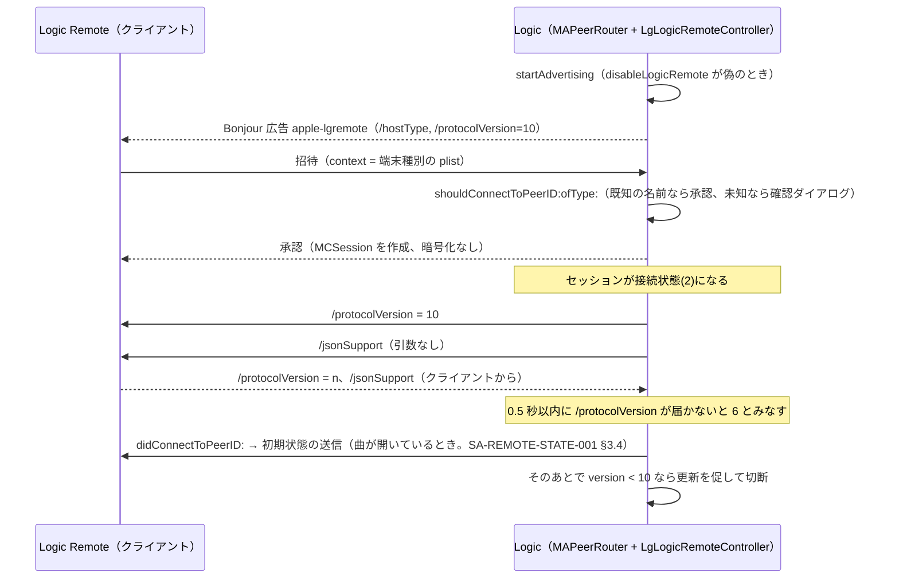

[日本語](SA-REMOTE-SESSION-001.md) | [English](SA-REMOTE-SESSION-001.en.md)

# SA-REMOTE-SESSION-001: Logic Remote の接続 — 広告・招待・承認・バージョンの順序

| 項目 | 内容 |
|---|---|
| 日付 | 2026-10-02 |
| Logic | 12.3.1（6682）、macOS 27.0 |
| 対象（arm64） | `MACore.framework`（ユニバーサル全体 SHA-256 `76ab2a5f…`、arm64 スライス `99a4a9ad…`）、`Logic.framework`（arm64 のみ `2f141e1a…`） |
| 方法 | **静的解析のみ**。Ghidra 12.1.4 の限定逆コンパイル（`Tools/ghidra/query.sh`）。Logic には何も送信せず、接続もしていない |
| 出力（ローカルのみ） | `Research/raw/ghidra/q-p3-macore.c`、`q-p3-macore2.c`、`q-p3-logic.c` |
| 関連 | [SA-002](SA-002-control-surface-assign-model.md)（メッセージの形式）・[SA-005](SA-005-logic-remote-state-push.md)（接続後の状態送信） |

**確信度の約束:** 逆コンパイルの内容と一致する事実は「確認」、そこからの推論は「仮説」と書く。
実機の通信では確認していない。

## 1. 全体の順序

## 2. 広告（Logic 側）

| 項目 | 確認した内容 | 根拠 |
|---|---|---|
| 開始条件 | ユーザーデフォルト `disableLogicRemote` が偽 | `LgLogicRemoteController::startAdvertising`（0x01682fc8） |
| サービス種別 | `MCNearbyServiceAdvertiser`、serviceType `apple-lgremote` | `MAPeerRouter::startAdvertising`（0x000f4d14） |
| 自分のピア名 | ホストのローカライズ名。UTF-8 で 62 バイトを超えると文字の境界で切る | `setupLocalPeer`（0x000f4ad8） |
| discoveryInfo | `/hostType`（文字列化した整数）、`/protocolVersion` = `"10"` | 同上。Bonjour の TXT（実機）と一致 |
| 無線の経路 | デリゲートが設定しない場合、`setAWDLDisabled:` を YES にする（非公開 API を `respondsToSelector` で確認して呼ぶ） | 同上 |

`/hostType` は機能フラグで 0 または 1 に設定されます（`FUN_01b92a80`）。観測値は 0。意味は**不明**。

## 3. 招待と承認

### 3.1 招待を受けたとき（Logic 側、確認）

`advertiser:didReceiveInvitationFromPeer:withContext:invitationHandler:`（0x000f7d9c）は、
メインのラン ループ（common modes）にブロック `FUN_000f8d28` を積みます。このブロックは次の順に動きます。

1. `context` があれば property list として読み、**整数を端末種別**とする。なければ `-1`。
2. デリゲートの `shouldConnectToPeerID:ofType:` に問い合わせる。
3. 承認なら、`MCSession` が未作成の場合に作る（`securityIdentity` なし、**暗号化の設定値 2**）。
   `invitationHandler(true, session)` を呼ぶ。
4. 拒否なら `invitationHandler(false, nil)`。

`MCEncryptionPreference` は Apple の公開仕様で optional = 0、required = 1、none = 2 です。
つまりセッションは**暗号化を求めず、証明書による相手の確認もありません**。

### 3.2 Logic の承認判断（確認）

`LgLogicRemoteController::shouldConnectToPeerID:ofType:`（0x016831b4）。

| 条件 | 結果 |
|---|---|
| 招待元の**表示名**が、登録済みの Logic Remote 端末の名前と一致 | 承認。その端末の記録を、新しいピアに紐付け直す |
| 一致しない | 確認ダイアログを表示。2 番目のボタン（ラベル `Connect`）が押されたときだけ承認し、端末を新規登録する |
| ダイアログで 2 番目以外 | 拒否 |

- 端末種別の文字列は、`0` iPad、`1` iPad Pro、`2` iPhone、`3` iPad Pro11、`4` iPad10、それ以外は Unknown。
- 新規登録は、グローバルなフラグ `DAT_026b0b58` が 0 のときに行う。フラグの意味は**不明**。
- 逆コンパイルでは `param_4 < 5` が符号付き比較に見える。種別が `-1`（context なし）だと、表の手前を読む可能性がある。
  研究用のピアは、有効な種別（0〜4）を context で送るのが安全。

**認可は表示名だけに基づきます。** ただし、**既存の端末と同じ名前を使って確認ダイアログを避けることは、
このプロジェクトでは行いません**（なりすましになるため）。独立した研究用ピアは、自分の名前で接続し、
Logic の確認ダイアログでユーザーが承認する前提です。

### 3.3 クライアント側（仮説）

`MAPeerRouter::connectToPeer:`（0x000f51c0）は、ブラウザが存在するとき次を行います。
`MCSession` を作る（暗号化の設定値 2）→ 非公開の設定を適用（`setPreferNCMOverEthernet:`、`setAWDLDisabled:`）→
`invitePeer:toSession:withContext:timeout:` を、context = **端末種別の整数のバイナリ plist（形式 200）**、**タイムアウト 30 秒**で呼ぶ。

これは同じ `MAPeerRouter` クラスの実装であり、iOS 版 Logic Remote が同じコードを使っているかは未確認です。
**Hypothesis**（確信度: 中。クラス名と対称的な構造からの推定）。

## 4. 接続後の順序（確認）

`MAPeerRouter::session:peer:didChangeState:`（0x000f8608）。MCSessionState は 0 = 未接続、2 = 接続。

### 接続したとき（状態 2）

1. ピアの記録がなければ、種別 `-1`・バージョン `-1`（不明）で作る。
2. 接続済みリストに追加。
3. **`/protocolVersion` = 10 を、そのピアに送る。**
4. `updateJSONCheck`：接続中の全ピアが JSON 対応なら `canUseJSON` を真にする。
5. **`/jsonSupport`（引数なし）を、そのピアに送る。**
6. セッションの接続数が 0 でなければ、ルーターを接続状態にする。
7. ピアの記録が**なかった**場合だけ、**0.5 秒後**にバージョン確認のタイマーを開始する。
8. デリゲートの `didConnectToPeerID:` を呼ぶ。

### 切断したとき（状態 0）

接続済みリストから外し、JSON 判定を更新し、デリゲートに通知する。
セッションの接続数が 0 になれば、接続状態とセッションを破棄し、登録されたハンドラに `didDisconnectFromAllPeers` を通知する。

## 5. バージョンと拒否

### 低レベルのメッセージ（`_handleLowLevelMessage:argument:peer:`、0x000f777c）

アドレスの比較は大文字小文字を区別しません。

| アドレス | 動作 |
|---|---|
| `/disconnectImmediately` | 直ちに切断 |
| `/jsonSupport` | そのピアを JSON 対応にして、`updateJSONCheck` |
| `/protocolVersion` | 引数の整数をそのピアのバージョンにする |
| 上記以外 | 処理せず、通常のメッセージ経路へ（戻り値 0） |

### バージョンが届かないとき

バージョンの初期値は `-1`（未受信）。次のいずれかで確定します。

- クライアントが `/protocolVersion` を送る。
- ブラウザ経路では discoveryInfo の `/protocolVersion` で初期化される。
- **0.5 秒のタイマー**後も未受信なら、**6 とみなす**（`_checkProtocolWaitTimeoutForPeer:`、0x000f6fcc）。
  同期の待ち（`waitForProtocolVersionIfNeededForPeerWithID:`）は、1 ms 刻みで最大約 2.5 秒ポーリングして同じ確認をする。

### Logic の最終判断

[SA-005 §2](SA-005-logic-remote-state-push.md) の接続ブロック（0x01699828）は、
ピアのバージョンが **10 未満**なら「Logic Remote を更新してください」の通知を出して切断します。
したがって、**`/protocolVersion` を黙っているクライアントは、6 とみなされて拒否される**はずです（**仮説**。ブロックの分岐から読んだもの）。

**順序の補足（確認）:** このブロックでは、**初期状態の送信がバージョンの確認より前**にある（[SA-REMOTE-STATE-001 §3.4](SA-REMOTE-STATE-001.md)）。
バージョンが 10 未満の peer にも、切断の前に初期状態が送られる可能性がある。ただし、バージョンの値がこのブロックの前に確定しているか（待ちが先に済むか）は未確認なので、実際に何が送られるかは通信で確かめる必要がある。

### 拒否・失敗の一覧

| 理由 | どこで | 結果 |
|---|---|---|
| `disableLogicRemote` が真 | `startAdvertising` | 広告されない。接続できない |
| ユーザーが確認ダイアログで承認しない | `shouldConnectToPeerID:ofType:` | 招待を拒否 |
| 招待に 30 秒以内に応答がない | クライアントのタイムアウト | クライアント側で失敗 |
| バージョンが 10 未満、または未送信（6 とみなす） | 接続ブロック | 更新を促す通知＋切断 |
| `/disconnectImmediately` を受信 | `_handleLowLevelMessage` | 切断 |
| セッションが 0（未接続）になる | `session:peer:didChangeState:` | 後始末と通知 |

## 6. 不明なこと・次の検証

| 項目 | 状態 | 次の手 |
|---|---|---|
| `/hostType` の意味（0 / 1） | 不明 | 機能フラグ `FUN_01b92a80` の呼び出し元と、別構成での値 |
| `MAPeerRouter::startAdvertising` の抑止フラグ `DAT_001b5a40`（`dispatch_once` で初期化） | 不明。真だと広告しない | 初期化ブロック `0x00181730` の解析 |
| 確認ダイアログの文言と最初のボタンのラベル | 未解決（ローカライズ資源） | 資源の文字列と `FUN_005882a8` の引数 |
| `DAT_026b0b58` の意味 | 不明 | 書き込み元の探索 |
| context なしの招待（種別 -1）の挙動 | 未確認 | 実機は PLAN-05 の承認後。静的には符号付き比較の確認のみ |
| クライアントが送る最初のメッセージ | 未確認 | iOS 版のバイナリがなければ、受信側の分岐から必要最小限を逆算 |
| 暗号化なしセッションの実際の通信内容 | 未確認 | PLAN-05 の受信実験（承認が必要） |

**この文書は接続の実装方法を保証しません。** 実際の接続は PLAN-05（研究用ピア）で、承認を得てから行います。
