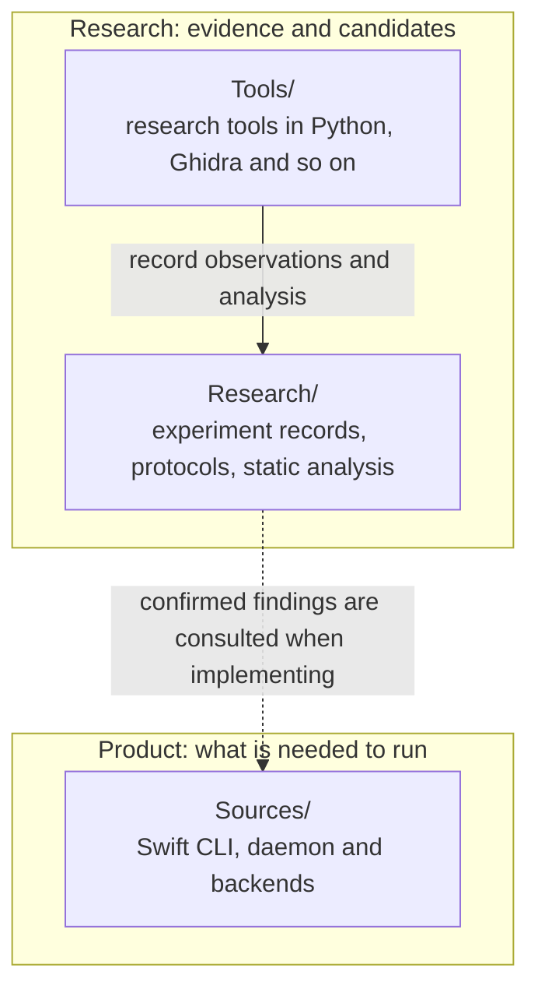

# Structure, and how an operation becomes "confirmed"

[日本語](architecture.md) | [English](architecture.en.md)

`logicctl` sends a command and the resident `logicd` operates Logic Pro.
After the operation it reads the state back from Logic and returns `verified: true` only if it matches the request.
Having sent a command does not make it confirmed.

For use see the [README](../README.en.md); for the commands and the JSON see the
[specification](specification.en.md).

> The Japanese [architecture](architecture.md) is the primary text. This English version follows it, except for the parts on the private
> AppleEvent route (its diagram node, the worked example and its details), which are only in Japanese for now.

## The whole picture first

```mermaid
flowchart LR
    user["Terminal / automation script"]
    cli["logicctl<br/>checks arguments, prints JSON"]
    socket["Unix socket<br/>one JSON per line"]
    daemon["logicd<br/>keeps the connection, runs one command at a time"]
    mcu["MCU backend<br/>operates and receives state over virtual MIDI"]
    logic["Logic Pro"]
    user --> cli --> socket --> daemon
    daemon -->|"the standard route"| mcu
    mcu -->|"MCU operations"| logic
    logic -->|"LED, LCD and fader state"| mcu
    mcu -->|"the state read back"| daemon
    daemon -->|"result JSON"| socket
    socket --> cli
    cli -->|"standard output"| user
```

A "backend" is a route that carries a command to Logic.
The standard one is the **MCU**: it provides a virtual MIDI port as a Mackie Control device
and connects to Logic's control surface setup.

The native AppleEvent route (`--backend appleevent`, play and stop only) is a second backend, described only in the Japanese text for now.
It still needs the MCU connection for the read-back.

## What each part does

| Part | Role | Main code |
|---|---|---|
| `logicctl` | Checks arguments; starts `logicd` if needed. When a request names a safeguard or a non-default route it first checks the daemon's capabilities, then sends the request and returns the JSON on standard output | [client](../Sources/logicctl/main.swift) |
| Unix socket | Carries requests and replies locally. One line is one JSON object | [message definitions](../Sources/LogicCore/Protocol/Messages.swift), [socket](../Sources/LogicCore/Protocol/UnixSocket.swift) |
| `logicd` | Keeps the virtual MIDI ports alive. Revalidates requests and runs concurrent commands one at a time. Handles the deadline, idempotency keys and the connection-generation precondition ([the execution contract](execution-contract.en.md)) | [daemon](../Sources/logicd/main.swift), [route selection](../Sources/LogicCore/Commands/CommandRouter.swift) |
| MCU backend | Operates play / stop, track selection, mute, solo, volume and pan, and reads Logic's feedback | [MCUBackend](../Sources/LogicCore/Backends/MCU/MCUBackend.swift), [received state](../Sources/LogicCore/Backends/MCU/MCUSurface.swift) |
| AppleEvent backend | See the Japanese text | [AppleEventTransportBackend](../Sources/LogicCore/Backends/AppleEvent/AppleEventTransportBackend.swift) |

The standard socket is `~/Library/Application Support/logicctl/logicd.sock`.
`LOGICCTL_SOCKET` changes it. JSON keys and command names are fixed machine-oriented names, and
diagnostic messages go to standard error.

## Stale state and "not known yet" are never success

Checking the transport uses this information:

| Information checked | Why it is needed |
|---|---|
| Logic's PID | So the state of a process from before a restart is not used for the Logic after the restart |
| The handshake generation | So the state and the bank position of an earlier connection are not used after the MIDI connection is redone |
| The LED / LCD update counters | To check that the information really arrived on the current connection, not a default. Where a change is needed, a new LED update is checked too |

Until **both** the play and the record LED have arrived after the current handshake,
the transport state is unknown. The initial `false` is not taken as "a stop was observed".
Information that arrives in the second half of the same MIDI batch as the handshake is kept.

A send or reply error, a failure to read back, or a mismatch with the request is `verified: false`.
A write whose reply is a success but whose state does not reach the request returns
`ok: false` / `error: "verification_failed"`.

A track number is a position in the mixer, so a write can carry the name it expects (`--expect-name`);
the MCU backend checks it against the LCD before anything is sent ([the target contract](target-contract.en.md)).
The bank position is trusted only while the name row is unchanged.

## The boundary between product code and research records

The product's `Sources/` needs none of `Research/`, `Tools/`, Python or `osascript` at run time.
A research candidate is never treated as a confirmed product feature.

The evidence for the live checks is in [EXP-AE-002](../Research/experiments/EXP-AE-002-cli-backend.md) and the MCU experiments
([the support matrix](../Research/protocol/support-matrix.tsv)) on the dedicated `LogicCLI-Test.logicx`.
A native state-query API and a Logic Remote client independent of the MCU
have not been verified yet. For the routes under study see the
[research architecture](../Research/architecture.md) and
[the analysis of how Logic sends state to Remote](../Research/static-analysis/SA-005-logic-remote-state-push.en.md).
