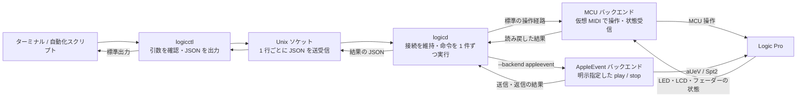
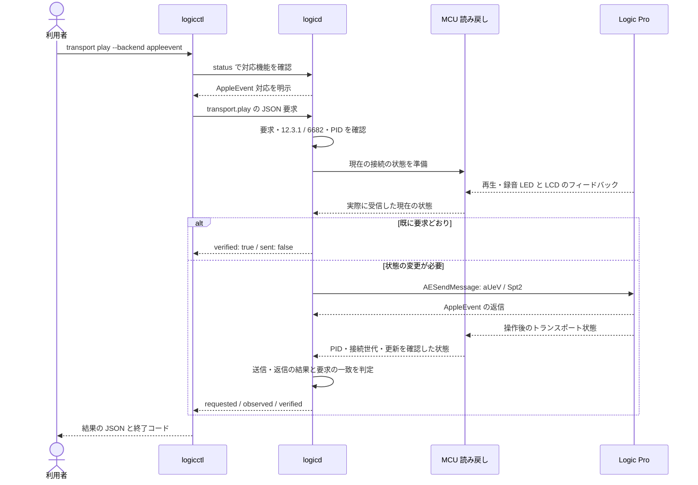
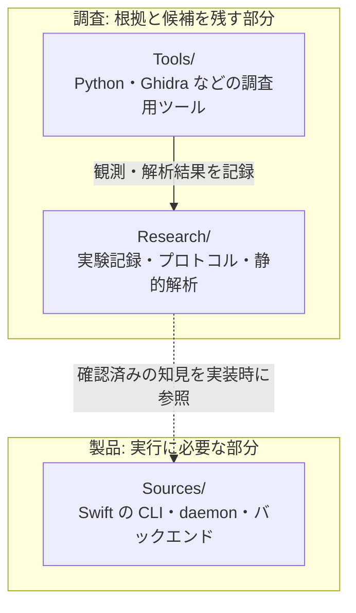

# 構成と、操作が「確認済み」になるまで

`logicctl` が命令を送り、常駐する `logicd` が Logic Pro を操作します。
操作後は Logic から状態を読み戻し、要求と一致した場合に `verified: true` を返します。
送信しただけでは確認済みになりません。

使い方は [README](../README.md)、コマンドと JSON の仕様は
[仕様書](specification.md) を参照してください。

## まず全体を見る

「バックエンド」は、Logic に命令を届ける経路です。
標準は **MCU**。Mackie Control の機器として仮想 MIDI ポートを用意し、
Logic のコントロールサーフェスに接続します。

**AppleEvent** は `--backend appleevent` と明示した再生・停止だけに使います。
書き込みは macOS の `AESendMessage`、読み戻しは独立した MCU 接続です。
対応を確認した Logic は **12.3.1 / build 6682** のみ。
現在は、この経路でも MCU 接続が必要です。

## それぞれの役割

| 部分 | 担当すること | 主なコード |
|---|---|---|
| `logicctl` | 引数を確認する。必要なら `logicd` を起動する。AppleEvent 指定時は対応機能を確認し、要求を送って JSON を標準出力に返す | [クライアント](../Sources/logicctl/main.swift) |
| Unix ソケット | ローカルで要求と応答を運ぶ。1 行が 1 つの JSON オブジェクト | [メッセージ定義](../Sources/LogicCore/Protocol/Messages.swift)、[ソケット](../Sources/LogicCore/Protocol/UnixSocket.swift) |
| `logicd` | 仮想 MIDI ポートを生かし続ける。要求を再検証し、同時に来た操作も 1 件ずつ実行する | [デーモン](../Sources/logicd/main.swift)、[経路選択](../Sources/LogicCore/Commands/CommandRouter.swift) |
| MCU バックエンド | 再生・停止、トラック選択、ミュート、ソロ、音量、パンなどを操作し、Logic のフィードバックを読む | [MCUBackend](../Sources/LogicCore/Backends/MCU/MCUBackend.swift)、[受信状態](../Sources/LogicCore/Backends/MCU/MCUSurface.swift) |
| AppleEvent バックエンド | 対応バージョンと実行中の PID を確認し、再生・停止を送信する。送信結果と MCU の読み戻しを合わせて判定する | [AppleEventTransportBackend](../Sources/LogicCore/Backends/AppleEvent/AppleEventTransportBackend.swift) |

標準のソケットは `~/Library/Application Support/logicctl/logicd.sock`。
`LOGICCTL_SOCKET` で変更できます。JSON のキーとコマンド名は機械向けの固定名、
診断メッセージは標準エラー出力に出します。

## 例: AppleEvent で再生し、結果を確認する

図は、対応機能と読み戻しを確保できた場合の流れです。
読み戻しの準備中に Logic が終了・再起動した場合や、再生・録音の状態が
まだ届いていない場合は、AppleEvent を送る前に失敗します。

すでに要求どおりなら、新しい命令を送らずに `sent: false` で返します。
特に停止の再送は再生ヘッドを動かすことがあるため、この確認に意味があります。
この場合も、Logic から実際に受信した状態が確認済みであることが条件です。

## 古い状態や「まだ不明」を成功にしない

トランスポートの確認では、次の情報を使います。

| 確認する情報 | なぜ必要か |
|---|---|
| Logic の PID | 再起動前のプロセスの状態を、再起動後の Logic に使わないため |
| handshake の世代 | MIDI 接続をやり直したとき、前の接続の状態やバンク位置を使わないため |
| LED / LCD の更新カウンター | 既定値ではなく、現在の接続から実際に届いた情報か確認するため。変更が必要な状態では、新しい LED 更新も確認する |

現在の handshake のあとに届いた再生・録音の **両方**の LED がそろうまで、
トランスポート状態は不明です。初期値の `false` を「停止を観測した」とは扱いません。
handshake と同じ MIDI batch の後半に届く情報も保持します。

送信や返信のエラー、読み戻し不可、要求との不一致は `verified: false` です。
AppleEvent の返信が成功でも、要求した状態にならなければ
`ok: false` / `error: "verification_failed"` を返します。
送信エラーのあとも可能な範囲で最終状態を読み、再送はしません。

## 製品コードと調査記録の境界

製品の `Sources/` は、実行時に `Research/`、`Tools/`、Python、`osascript` を
必要としません。調査の候補を、確認済みの製品機能として扱うこともありません。

実機検証の根拠は [EXP-AE-002](../Research/experiments/EXP-AE-002-cli-backend.md)。
専用の `LogicCLI-Test.logicx` で AppleEvent の再生・停止と MCU の読み戻しを確認しています。
ネイティブな状態問い合わせ API と、MCU に依存しない Logic Remote クライアントは
まだ検証されていません。調査中の経路は
[調査構成図](../Research/architecture.md) と
[Logic Remote の状態送信解析](../Research/static-analysis/SA-005-logic-remote-state-push.md) を参照してください。
