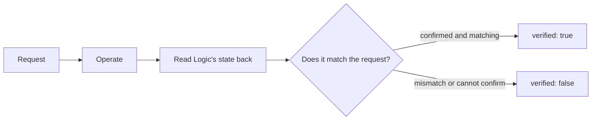

# The logicctl specification — commands and how to read results

[日本語](specification.md) | [English](specification.en.md)

[Back to the README](../README.en.md) · [Architecture](architecture.en.md) · [Research guide](../Research/README.md)

The Japanese [specification](specification.md) and this English version describe the same commands and result contract.

## 1. The idea

`logicctl` is a tool that **asks for a state and returns the state it could confirm from Logic**.
For playback, for example, it requests `requested.playing: true` and, if Logic is really playing, returns `observed.playing: true`.



A read command has no write to verify, so even when it succeeds it returns `verified: false`.

## 2. Commands

`logicctl` means `.build/release/logicctl` after a build.

| Command | Input | What it returns / does |
|---|---|---|
| `status` | none | The daemon's PID, Logic's version, the MCU connection, supported features, and whether the environment is a verified one (`compatibility`). With a connection it also returns the play state |
| `state` | none | The play state, the playhead (`position`), the selected track and information about all strips. `position` is the MCU time display's text (`display`) and BEATS/SMPTE (`mode`); in BEATS mode it is also split into `bar`, `beat`, `division` and `tick`. `null` until the display has arrived, and again after the display mode changes until the digits are re-sent. With both the BEATS and SMPTE LEDs on, `mode` is `null` and nothing is split. Logic sends only the digits that change, so a read during an update can mix old and new digits (a reading of the display, not an atomic value). The split was checked against one stopped value on the real Logic only |
| `transport play` | none | Requests playback |
| `transport stop` | none | Requests stop |
| `track list` | none | An array of all channel strips |
| `track get <n>` | an integer ≥ 1 | Name, volume, pan, mute, solo, selection and record-arm |
| `track select <n>` | an integer ≥ 1 | Requests the selection |
| `track mute <n> on\|off` | number and state | Requests mute |
| `track solo <n> on\|off` | number and state | Requests solo |
| `track arm <n> on\|off` | number and state | Requests record-enable (checked by the REC LED; a strip that cannot be armed, such as an output or Master, fails verification). **Tested against the fake Logic only; not yet checked on the real Logic** |
| `track volume <n> <dB>` | a number of 6.0 or less, or `-inf` | Requests the volume |
| `track pan <n> <value>` | `-1` to `1` | Requests the pan, left to right |
| `daemon stop` | none | Ends the resident process. It starts again automatically on the next use |
| `debug mcu <hex>` | hexadecimal bytes; separate several messages with `;` | For research: sends raw MIDI and returns the received state. No write verification |

**The track number is the order in the mixer.** Stereo Out and Master are included.
Check numbers and names with `track list` first. Fetching the list moves the MCU's displayed range.

### Options

| Option | Applies to | Meaning |
|---|---|---|
| `--json` | every command | For compatibility. Output is always JSON |
| `--backend mcu` | every command | Names the usual virtual-MIDI route explicitly |
| `--backend appleevent` | play and stop | Names the native AppleEvent route (see §4) |
| `--tolerance <dB>` | `track volume` | A finite value of 0 or more. The default is 0.1 dB |
| `--idempotency-key <key>` | commands that change state | Folds a resend into one execution. [The execution contract](execution-contract.en.md) |
| `--expect-session <generation>` | everything except `daemon stop` | Runs only if it matches the `handshake_generation` of a read |
| `--deadline-ms <ms>` | everything except `daemon stop` | Upper bound for waiting plus running (default 30000) |
| `--expect-name <name>` | `track get\|select\|mute\|solo\|arm\|volume\|pan` | Runs only if the displayed track name matches. Pass the `name` that `track list` returned. [The target contract](target-contract.en.md) |

Options may be placed before or after the command. A repeated option, a missing value or an unknown option is an argument error.
Pan is sent rounded to Logic's `-64` to `63`, so the right edge may read back as `63/64`.

## 3. Success, confirmed and unknown

| Situation | `ok` | `verified` | How to read it |
|---|---|---|---|
| The state could be read | `true` | `false` | The read succeeded |
| The state after the operation matched | `true` | `true` | The requested state was confirmed |
| An operation that can skip sending found the state already as requested | `true` | `true` | Nothing was resent; the confirmed state is returned |
| The reply succeeded but the state differs | `false` | `false` | The operation is not confirmed |
| The state cannot be read back | `false` | `false` | The result is unknown. It is not treated as success |

```json
{
  "id": "a value identifying the request",
  "command": "transport.stop",
  "ok": true,
  "verified": true,
  "backend": "appleevent",
  "readback_backend": "mcu",
  "requested": {"playing": false, "recording": false},
  "observed": {"playing": false, "recording": false},
  "result": {"sent": true, "command_id": 5}
}
```

This is an excerpt of the main parts. A normal response carries more, such as `execution` and `observation`.
`null` means unknown or not obtained. It is not `false` or `0`. For example `mute: null` during a solo cannot be read as "mute is off".
A read response carries `observation`, which says how complete, fresh and sourced the result is. See [the read contract](observation-contract.en.md).
Every response carries `execution`, which says how a resend, a timeout or a conflict was handled. See [the execution contract](execution-contract.en.md).
A track number is a position in the mixer. The check that keeps a write from reaching another track when the order changes is in [the target contract](target-contract.en.md).
The verified environment, the side effects (reads included) and the conditions for release are in [compatibility](compatibility.en.md).

## 4. The AppleEvent route

- Supported Logic profile: **12.3.1 / build 6682**. The running PID is the target.
- Supported commands: play and stop. Recording, seeking and mixer operations are not accepted through this route.
- Before operating, receive the MCU play and record LEDs and establish the state of the current session.
- After operating, read the state back through the MCU. Stop requires both `playing: false` and `recording: false`.
- If Logic's PID or the connection generation changes, do not judge success using old state.
- A send error or timeout still returns the final state if available. The write is not automatically resent.

| `result` field | Meaning |
|---|---|
| `sent` | Whether sending was attempted. `false` if the state already matched |
| `event_class` / `event_id` | `aUeV` / `Spt2` |
| `command_id` | Play `3`, stop `5`; `null` if nothing was sent |
| `target_pid` | Logic process targeted by the event |
| `appleevent_send_status` | Sending API result; normal status is `0` |
| `appleevent_reply_received` | Whether a reply in AppleEvent form was received |
| `appleevent_reply_error` | Error returned by Logic; `null` if the reply omitted the field |
| `logic_version` / `logic_build` | Version and build of the target |

**An omitted error field is not replaced with an observed error code of 0.**
Sending, reply reception and state verification are returned as separate information.

## 5. When something goes wrong

| `error` | Meaning | What to check next |
|---|---|---|
| `usage` / `invalid_argument` | Bad syntax or value | `--help`, the number, the value, the route |
| `logic_not_running` | Logic is not running | Start Logic |
| `surface_not_connected` | The MCU cannot connect | `status`, Logic's control surface setup |
| `readback_unavailable` | The state cannot be confirmed | `status` after the connection settles |
| `timeout` | It did not finish in time. **It may have been executed** | Read the state again. The same key is not rerun |
| `outcome_unknown` / `request_in_flight` | The previous run of the same key is unknown / still running | Read the state; use another key if needed |
| `idempotency_key_conflict` | The same key with different content | Use another key |
| `precondition_failed` | The `--expect-session` generation differs (nothing was sent) | Read the state again |
| `target_mismatch` | `--expect-name` differs from the name displayed at that position (nothing was sent) | Re-read with `track list` and choose the target again; use a new idempotency key |
| `session_changed` | Logic re-ran the MCU handshake after a button was pressed and before confirmation finished (mute, solo, arm). **The press may have reached Logic.** Evidence is always read together with the connection generation, and the generation is checked again before a second press; but a reconnect in the brief gap between that check and the send can let the second press reach the new connection (the result is still this error, never verified) | Read the state again; retry with a new idempotency key |
| `deadline_exceeded` / `queue_full` / `shutting_down` | It was not started | Try again later |
| `scan_incomplete` / `bank_home_failed` | The list could not be confirmed to the end (the result is partial) | `observation.problem`; run it again |
| `verification_failed` | The state differs from the request | `requested` and `observed` |
| `no_such_track` / `bank_unknown` | The strip cannot be identified | `track list` and the connection |
| `daemon_upgrade_required` | An older daemon is running (it does not support the requested route or safeguard; nothing was sent) | Run `daemon stop` with the new build and repeat |
| `unsupported_logic_version` | Outside what the native route supports | The version and build |
| `logic_instance_changed` | Logic restarted during verification | Check state on the new connection |
| `appleevent_permission_denied` | macOS denied Automation permission | Automation permission |
| `appleevent_timeout` | AppleEvent timed out | `observed`; it may already have been executed |
| `appleevent_not_handled` / `no_project` | Event not handled / no current song | Logic's state and the open project |
| `appleevent_send_failed` / `appleevent_reply_failed` / `appleevent_invalid_reply` | Send or reply problem | Codes and state in `result` |
| `backend_mismatch` | The reply's route differs from the requested one | Update the daemon. The request was not resent |
| `daemon_unavailable` | Cannot talk to the daemon | The executable, the socket, the log |

The current CLI returns exit status `0` on success, `1` for `ok: false` in the JSON and `64` for a CLI syntax error.
The exit status `3` for a connection failure in earlier descriptions is not used by the current implementation.
`--help` prints guidance to standard error and exits `0`; with no arguments it prints the same guidance and exits `64`. These two produce no JSON.
JSON keys, command names and error identifiers are fixed English values. Guidance for people and `message` are in Japanese.

## 6. Connection and compatibility

`logicctl` and `logicd` exchange **one JSON per line** over a local Unix socket.
A request has `id`, `command`, a string dictionary `args`, and an optional `backend`.
When `backend` is omitted it is the former MCU route, so earlier requests can still be read.

Before a request that names a safeguard (`--idempotency-key`, `--expect-session`, `--deadline-ms`, `--expect-name`) or a non-default route,
`logicctl` first asks `status` over the same connection, and sends nothing to a daemon that does not report the matching capability in `result.capabilities`.
A capability shows whether the daemon implements the feature. Whether the current Logic version or the MCU connection is usable is checked separately.

Environment variables: `LOGICCTL_SOCKET` for the socket, `LOGICD_PATH` for the daemon's location, and `LOGICD_TRACE=1` for detailed MIDI logging.
The product code does not call research scripts. The detailed evidence is in [EXP-AE-002](../Research/experiments/EXP-AE-002-cli-backend.md).
