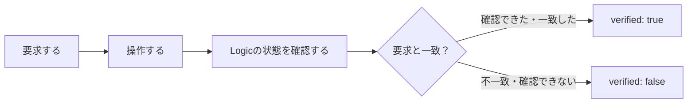

# logicctl の仕様 — コマンドと結果の読み方

[READMEに戻る](../README.md) · [図で読む仕組み](architecture.md) · [調査ガイド](../Research/README.md)

## 1. 基本の考え方

**「この状態にして」と要求し、Logicから確認できた状態を返す**道具です。
たとえば再生なら `requested.playing: true` を要求し、実際に再生中なら `observed.playing: true` を返します。



読み取りコマンドには書き込みの検証がないため、成功しても `verified: false` です。

## 2. コマンド

`logicctl` はビルド後の `.build/release/logicctl` を指します。

| コマンド | 入力 | 戻る情報・動作 |
|---|---|---|
| `status` | なし | daemonのPID、Logicのバージョン、MCUの接続、対応機能。接続があると再生状態も返す |
| `state` | なし | 再生状態、選択中のトラック、全ストリップの情報 |
| `transport play` | なし | 再生を要求 |
| `transport stop` | なし | 停止を要求 |
| `track list` | なし | 全チャンネルストリップの配列 |
| `track get <n>` | 1以上の整数 | 名前・音量・パン・ミュート・ソロ・選択・録音待機 |
| `track select <n>` | 1以上の整数 | 選択を要求 |
| `track mute <n> on\|off` | 番号と状態 | ミュートを要求 |
| `track solo <n> on\|off` | 番号と状態 | ソロを要求 |
| `track volume <n> <dB>` | 6.0以下の数、または `-inf` | 音量を要求 |
| `track pan <n> <値>` | `-1`〜`1` | 左〜右のパンを要求 |
| `daemon stop` | なし | 常駐プロセスを終了。次の利用で自動起動 |
| `debug mcu <hex>` | 16進数のバイト列。複数は `;` 区切り | 調査用の生MIDI送信と受信状態。書き込み検証は行わない |

**トラック番号はミキサーの並び順**です。Stereo Out・Masterも含みます。
番号と名前は、先に `track list` で確認してください。一覧の取得では、MCUの表示範囲を移動します。

### オプション

| オプション | 範囲 | 意味 |
|---|---|---|
| `--json` | 全コマンド | 互換用。出力は常にJSON |
| `--backend mcu` | 全コマンド | 通常の仮想MIDI経路を明示 |
| `--backend appleevent` | 再生・停止 | native AppleEvent経路を明示 |
| `--tolerance <dB>` | `track volume` | 0以上の有限値。既定は0.1 dB |
| `--idempotency-key <キー>` | 状態を変更するコマンド | 再送を1回の実行にまとめる。[実行の契約](execution-contract.md) |
| `--expect-session <世代>` | `daemon stop` 以外 | 読み取りの `handshake_generation` と一致するときだけ実行 |
| `--deadline-ms <ミリ秒>` | `daemon stop` 以外 | 待ち時間と実行の上限（既定 30000） |

オプションはコマンドの前後に置けます。同じオプションの重複、値の省略、未知のオプションは引数エラーです。
パンはLogicの `-64`〜`63` に丸めて送るため、右端は取得時に `63/64` になる場合があります。

## 3. 成功・確認済み・不明の違い

| 状況 | `ok` | `verified` | どう読む？ |
|---|---|---|---|
| 状態を読み取れた | `true` | `false` | 読み取りに成功した |
| 操作後の状態が一致した | `true` | `true` | 要求した状態を確認できた |
| 送信を省略できる操作で、既に要求どおりだった | `true` | `true` | 再送信せず、確認できた状態を返した |
| 応答は成功したが状態が違う | `false` | `false` | 操作は確認できていない |
| 状態を読み返せない | `false` | `false` | 結果は不明。成功と扱わない |

```json
{
  "id": "リクエストを識別する値",
  "command": "transport.stop",
  "ok": true,
  "verified": true,
  "backend": "appleevent",
  "readback_backend": "mcu",
  "requested": {"playing": false, "recording": false},
  "observed": {"playing": false, "recording": false},
  "result": {"sent": true, "command_id": 5}
}
```

これは主要部分を抜粋した例です。通常の応答には `result` 内の送信情報なども入ります。
`null` は不明・未取得を表します。`false` や `0` ではありません。たとえばソロ中の `mute: null` は「ミュートがオフ」とは読めません。
読み取りの応答には、結果の完全性・鮮度・出どころを示す `observation` が付きます。詳しくは[読み取り結果の契約](observation-contract.md)。
すべての応答には、再送・時間切れ・競合の扱いを示す `execution` が付きます。詳しくは[書き込みの実行契約](execution-contract.md)。

## 4. AppleEvent経路の条件

- 対応するLogicは **12.3.1 / build 6682**。起動中のPIDを対象にする。
- 対応コマンドは再生・停止。録音・シーク・ミキサー操作はこの経路では受け付けない。
- 操作前にMCUの再生・録音LEDを受信し、現在のセッションの状態を確認する。
- 操作後はMCUから状態を読み返す。停止では `playing: false` と `recording: false` の両方を確認する。
- LogicのPIDや接続の世代が変わった場合、古い状態から成功を判定しない。
- 送信エラー・時間切れでも、取得できた最終状態を返す。自動再送信はしない。

| `result` の項目 | 意味 |
|---|---|
| `sent` | 送信を試みたか。既に要求どおりなら `false` |
| `event_class` / `event_id` | `aUeV` / `Spt2` |
| `command_id` | 再生 `3`、停止 `5`。無送信なら `null` |
| `target_pid` | 送信先のLogicプロセス |
| `appleevent_send_status` | 送信APIの結果。正常は `0` |
| `appleevent_reply_received` | AppleEvent形式の応答を受け取れたか |
| `appleevent_reply_error` | Logicが返したエラー。項目が省略された応答では `null` |
| `logic_version` / `logic_build` | 操作対象のバージョン |

**応答のエラー項目がないことを、観測したエラーコード0に置き換えません。**
送信・応答・状態の確認は、別の情報として返します。

## 5. 困ったとき

| `error` | 意味 | 次に確認すること |
|---|---|---|
| `usage` / `invalid_argument` | 書式・値が不正 | `--help`、番号・値・指定経路 |
| `logic_not_running` | Logicが起動していない | Logicの起動 |
| `surface_not_connected` | MCUの接続ができない | `status`、Logicのコントロールサーフェス設定 |
| `readback_unavailable` | 状態を確認できない | 接続が安定したあとに `status` |
| `timeout` | 時間内に完了しなかった。**実行された可能性がある** | 状態を読み直す。同じキーは再実行されない |
| `outcome_unknown` / `request_in_flight` | 同じキーの前回が不明 / 実行中 | 状態を読み直し、必要なら別のキー |
| `idempotency_key_conflict` | 同じキーで内容が違う | 別のキーを使う |
| `precondition_failed` | `--expect-session` の世代と違う（送信していない） | 状態を読み直す |
| `deadline_exceeded` / `queue_full` / `shutting_down` | 実行を始めなかった | 後でやり直す |
| `scan_incomplete` / `bank_home_failed` | 一覧を最後まで確認できない（結果は途中まで） | `observation.problem`。もう一度実行 |
| `verification_failed` | 要求と状態が一致しない | `requested` と `observed` |
| `no_such_track` / `bank_unknown` | 指定したストリップを特定できない | `track list` と接続 |
| `daemon_upgrade_required` | 古いdaemonが動いている | 新ビルドで `daemon stop` 後に再実行 |
| `unsupported_logic_version` | native経路の対応外 | バージョン・build |
| `logic_instance_changed` | 確認中にLogicが再起動した | 新しい接続で状態を確認 |
| `appleevent_permission_denied` | macOSの権限で拒否 | オートメーションの許可 |
| `appleevent_timeout` | AppleEventの時間切れ | `observed`。既に実行された可能性がある |
| `appleevent_not_handled` / `no_project` | イベント未処理 / 現在の曲がない | Logicの状態と開いたプロジェクト |
| `appleevent_send_failed` / `appleevent_reply_failed` / `appleevent_invalid_reply` | 送信・応答の問題 | `result` のコードと状態 |
| `backend_mismatch` | 応答の経路が指定と異なる | daemonの更新。再送信は行われていない |
| `daemon_unavailable` | daemonと通信できない | 実行ファイル・ソケット・ログ |

現在のCLIは、成功で終了コード `0`、JSONの `ok: false` で `1`、CLIの書式エラーで `64` を返します。
以前の説明にある接続失敗の終了コード `3` は、現在の実装では使っていません。
`--help` は標準エラーに案内を表示して `0`、引数なしは同じ案内を表示して `64` で終了します。この2つにはJSON出力がありません。
JSONのキー・コマンド名・エラー識別子は英語の固定値です。人向けの案内・`message` は日本語です。

## 6. 接続と互換性

`logicctl` と `logicd` は、ローカルのUnixソケットで **1行1JSON** を交換します。
リクエストは `id`・`command`・文字列辞書 `args` と、任意の `backend` です。
省略時は従来のMCU経路になるため、以前のリクエストも読み込めます。

明示AppleEventの利用時は、同じ接続でまず `status` を問い合わせます。
`result.capabilities.appleevent_transport: true` がないdaemonには操作リクエストを送りません。
この対応機能はdaemon側の実装の有無を示します。今のLogicのバージョンやMCU接続の可否は、別に確認します。

環境変数は `LOGICCTL_SOCKET`：接続先、`LOGICD_PATH`：daemonの場所、`LOGICD_TRACE=1`：MIDIの詳細ログです。
製品実装は調査スクリプトを呼びません。詳細な根拠は[EXP-AE-002](../Research/experiments/EXP-AE-002-cli-backend.md)にあります。
